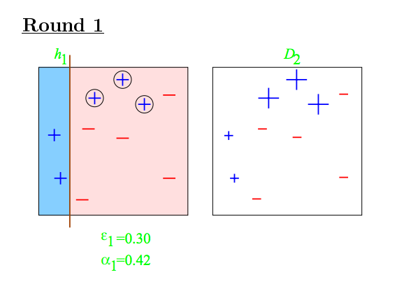
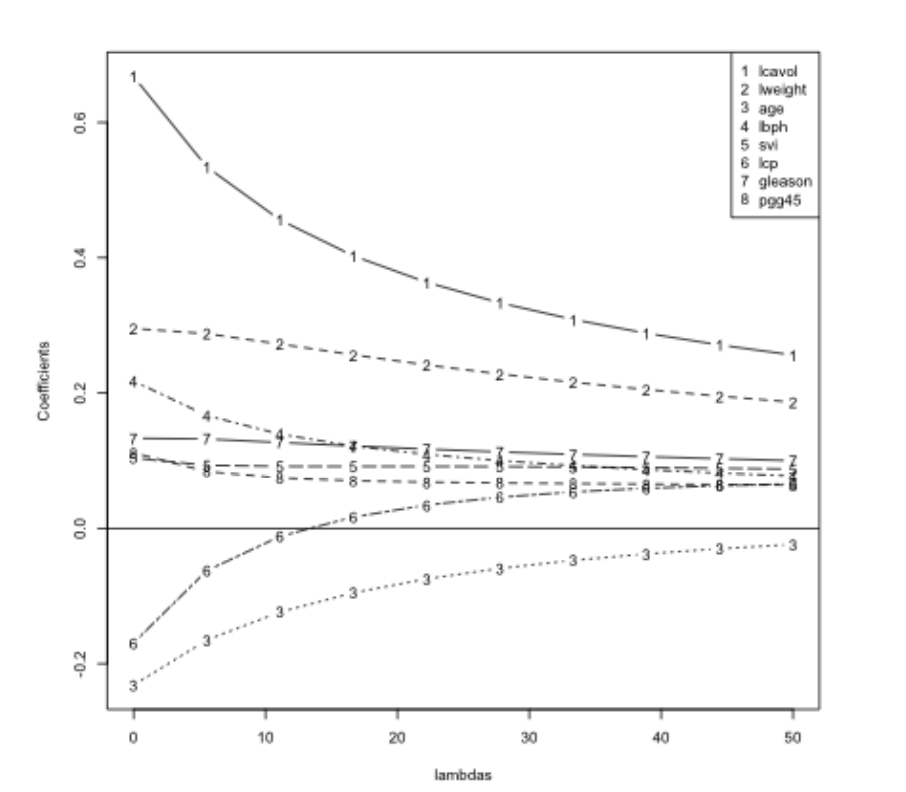

```{r setup, include=FALSE}
knitr::opts_chunk$set(echo = TRUE)
```

# Intro  
* This course covers the basic ideas behind machine learning/prediction  
  + Study Design - training vs. test sets  
  + Conceptual issues - out of sample error, overfitting, ROC curves  
  + Practical Implementation - the caret package  
* What this course depends on:  
  + The Data Scientist's Toolbox  
  + R Programming  
* What would be useful  
  + Exploratory Analysis  
  + Reproducible Research  
  + Regression Models  
  + (Notes on these 5 courses are all in my GitHub repoes)  
  
## GitHub Link for Lectures  
**[Practical Machine Learning lectures on GitHub](https://github.com/bcaffo/courses/tree/master/08_PracticalMachineLearning)**  

## Course Book  
**[The book for this course is available on this site](https://web.stanford.edu/~hastie/ElemStatLearn//)**  

## Instructor's Note  
"*Welcome to Practical Machine Learning! This course will focus on developing the tools and techniques for understanding, building, and testing prediction functions.*  
  
*These tools are at the center of the Data Science revolution. Many researchers, companies, and governmental organizations would like to use the cheap and abundant data they are collecting to predict what customers will like, what services to offer, or how to improve people's lives.*  
  
*Jeff Leek and the Data Science Track Team*"  


# Prediction, Errors, and Cross Validation  
## Prediction  
### Prediction Motivation  
* Who predicts things?  
  + Local governments -> pension payments  
  + Google -> whether you will click on an ad  
  + Amazon -> what movies you will watch  
  + Insurance companies -> what your risk of death is  
  + Johns Hopkins -> who will succeed in their programs  
* Why predict things  
  + Glory (Nerd cred for accomplishing certain feats)  
    - A lot of competitions are hosted on **[Kaggle](http://www.kaggle.com/)**  
  + Riches (Completing some competition that offers a reward)  
  + Save lives  
    - **[On cotype DX](http://www.oncotypedx.com/en-US/Home)** reveals the underlying biology that changes treatment decisions 37% of the time.  

#### More Resources
* **[A course on more advanced material about ML](https://www.coursera.org/course/ml)**  
* **[List of machine learning resources on Quora](http://www.quora.com/Machine-Learning/What-are-some-good-resources-for-learning-about-machine-learning-Why)**  
* **[List of machine learning resources from Science](http://www.sciencemag.org/site/feature/data/compsci/machine_learning.xhtml)**  
* **[Advanced notes from MIT open courseware](http://ocw.mit.edu/courses/electrical-engineering-and-computer-science/6-867-machine-learning-fall-2006/lecture-notes/)**  
* **[Advanced notes from CMU](http://www.stat.cmu.edu/~cshalizi/350/)**  
* **[Kaggle - machine learning competitions](http://www.kaggle.com/)**  

### What is Prediction?  
#### Main Idea  
* One focus of ML is on what algorithms are the best for extracting information and using it to predict.  
* Although the method used for producing a training set is also quite important  

  
* One starts off with a dataset  
1) One uses Probability/Sampling to select a Training Set  
2) One measures characteristics of this training set to create a Predicition Function  
3) One then uses the Prediction Function to take an uncolored dot and predict if it's red or blue  
4) One would then go on to test how well their Prediction Function works  

#### What Can Go Wrong  
* An example is **[Google Flu trends](http://www.sciencemag.org/content/343/6176/1203)** (**[A free overview of the issue witht he accuracy](https://en.wikipedia.org/wiki/Google_Flu_Trends#Accuracy)**)  
  - Google tried to predict rate of flu using what people would search  
  - Originally the algorithm was able to represent how many cases would appear in a region within a certain time  
  - Although they didn't account for the fact that the terms would change over time  
  - The way the terms were being used wasn't well understood so when terms changed they weren't able to accurately account for the change.  
  - It also overestimated as it the search terms it looked at were often cofactors with other illnesses  
  
#### Componets of a Predictor  
1) Question  
* Any problem in data science starts with a question, "What are you trying to predict and what are you trying to predict it with?"  

2) Input Data  
* Collect best input data you can to use to predict  

3) Features  
* From that data one builds features that they will use to predict  

4) Algorithm  
* One uses ML algorithms to develop a function  

5) Parameters  
* Estimate parameters of the algorithm  

6) Evaluation  
* Apply algorithm to a data set to evaluate how well the algorithm works  

#### Example  
* Start with a general question, "Can I automatically detect emails that are SPAM and those that are not?"  
* Make the question more concrete, "Can I use quantitative characteristics of the emails to classify them as SPAM/HAM?"  
* Find input data  
  + In this instance there is data avaliable in R via the `kernlab` package  
  + Note that this data set won't necessarily be the perfect data as it doesn't contain all the emails ever sent, or the emails sent to you personally  
* Quantify features, such as the frequency of certain words or typeface. The `spam` dataset from `kernlab` contains these types of frequency.  
```{r}
library(kernlab)
data(spam)
str(spam)
```
```{r}
plot(density(spam$your[spam$type=="nonspam"]),
     col = "#5BC2E7", main = "", xlab = "Frequency of 'your'")
lines(density(spam$your[spam$type=="spam"]), col = "#FF0000")
```
  
 * It can be seen here "your" appears more often in SPAM emails than it does in HAM  
  + One could use this idea to create a cut-off point for predicting if a message is SPAM  
* The proposed algorithm  
  + Find a value of $C$  
  + If the frequency of $'your'>C$ predict the message is SPAM  
```{r}
plot(density(spam$your[spam$type=="nonspam"]),
     col = "#5BC2E7", main = "", xlab = "Frequency of 'your'")
lines(density(spam$your[spam$type=="spam"]), col = "#FF0000")
abline(v = 0.5, col = "#000000")
```
  
* Choosing 0.5 would contain most spam messages and avoid the second spike of HAM emails  
* We then evaluate this predictor  
```{r}
prediction <- ifelse(spam$your > 0.5, "spam", "nonspam")
res <- table(prediction, spam$type)/length(spam$type)
res
```
  
* In this case our accuracy is `r round(res[1,1], 4)` + `r round(res[2,2], 4)` = `r round(res[1,1]+res[2,2], 4)`, or an accuracy of approximately `r round((res[1,1]+res[2,2])*100, 2)`%, although this is an opptamistic measure of the overall error, which will be discussed further later.    


### Relative Importance of Steps  
question > data > features/variables > algorithms  
"*The commbinaiton of some data and an aching desire for an answer does not ensure that a reasonable answer can be extracted from a given body of data.*" -John Tukey  

* In other words, an important component of prediction is knowing when to give up, that is that the data is not sufficient  

#### Input Data: Garbage in = Garbage out  
1. May be easy (movie ratings -> new movie ratings)  
2. May be harder (gene expression data -> disease)  
3. Depends on what is a "good prediction".  
4. Often more **[data > better models](http://www.youtube.com/watch?v=yvDCzhbjYWs)**  
5. The most important step is collecting the right data  

#### Features: They matter!  
* Properties of good features  
  + Lead to data compression  
  + Retain relevant information  
  + Are created based on expert application knowledge  
* Common mistakes  
  + Trying to automate feature selection (Although they may be automated with care)  
  + Not paying attention to data-specific quirks  
  + Throwing away information unnecessarily  

#### Algorithm: They Matter Less Than You'd Think  
  
  
* The above table shows that the Linear Discrimenate Analysis (Lindisc) error often was not that far off from the best method  
* Using the best approach doesn't always largely improve the error  

#### Issues to Consider  
* The "Best" machine learning method would be:  
  + Interpretable  
    - If predictor is to be presented to an uninformed audience you'd want to to be understandable by them  
  + Simple  
    - Helps with interpretablity  
  + Accurate  
    - Getting a model to be interpretable can sometimes hurt the accuracy  
  + Fast  
    - Quick build the model, train, and test  
  + Scalable  
    - Easy to apply to a large dataset (either fast or parallelizable)  

#### Prediction is About Accuracy Tradeoffs  
* Tradeoffs are made for interpretability, speed, simplicity, or scalability.  
* Interpretability matters, decision tree-like results are more interpretable
  + "**if** total cholesterol $\geq 160$ **and** they smoke **then** *10 year CHD risk* $\geq$ *5%* **else if** they smoke **and** systolic blood pressure $\geq$ 140 **then** *10 year CHD risk* $\geq$ 5% **else** *10 year CHD risk* < 5%"  
* Scalability matter  
  + in "The Netflix $1 Million Challenge" Netflix never implemented the solution itself because the algorithm wasn't scalable and took way too long on the big data sets that Neflix was working with, so they went with something that was less accurate but more scalable.  


## Errors  
### In and Out of Sample Errors  
* **In Sample Error** - Sometimes called *resubstitution error*. The error rate you get on the same data set you used to build your predictor.  
* **Out of Sample Error** - Sometimes called *generalization error*. The error rate you get on a new data set.  
* Key Ideas  
1) Out of sample error is what you care about  
2) In sample error < out of sample error  
  + Sometimes you want to give up some accuracy on the data you have to have greater accuracy on unkown data.  
3) The reason is overfitting  
  + Matching your algorithm to the noise of the data you have  

#### Spam Example  
```{r warning = FALSE}
library(kernlab)
data(spam)
RNGkind(sample.kind = "Rounding")
set.seed(333)
smallSpam <- spam[sample(dim(spam)[1], size = 10),]
spamLabel <- (smallSpam$type == "spam")*1 + 1
plot(smallSpam$capitalAve, col = spamLabel, pch = 3)
abline(h = 2.7, col = "#FF0000")
abline(h = 2.40, col = "#000000")
abline(h = 2.80, col = "#5BC2E7")
```
  
##### Prediction 1  
* capitalAve > 2.7 = "spam"  
* capitalAve < 2.40 = "nonspam"
* We can add 2 params to make the prediction perfect for the training set  
  + capitalAve between 2.40 and 2.45 = "spam"  
  + capitalAve between 2.45 and 2.7 = "nonspam"  
```{r}
rule1 <- function(x){
  prediction <- rep(NA, length(x))
  prediction[x > 2.7] <- "spam"
  prediction[x < 2.40] <- "nonspam"
  prediction[(x >= 2.40 & x <= 2.45)] <- "spam"
  prediction[(x > 2.45 & x <= 2.70)] <- "nonspam"
  return(prediction)
}
table(rule1(smallSpam$capitalAve),smallSpam$type)
```

##### Prediction 2  
* (Note: The blue line in the plot is for 2.8)
* capitalAve > 2.80 = "spam"  
* capitalAve $\leq$ 2.80 = "nonspam"  
* This algorithm won't be perfect on the training data  
```{r}
rule2 <- function(x){
  prediction <- rep(NA, length(x))
  prediction[x > 2.8] <- "spam"
  prediction[x <= 2.8] <- "nonspam"
  return(prediction)
}
table(rule2(smallSpam$capitalAve), smallSpam$type)
```

##### Apply 2 rulesets to all spam data  
```{r}
table(rule1(spam$capitalAve),spam$type)
table(rule2(spam$capitalAve),spam$type)
paste0("Rule 1 accuracy: ", 
       mean(rule1(spam$capitalAve) == spam$type))
paste0("Rule 2 accuracy: ", 
       mean(rule2(spam$capitalAve) == spam$type))
paste0("Rule 1 total correct: ",
       sum(rule1(spam$capitalAve) == spam$type))
paste0("Rule 2 total correct: ",
       sum(rule2(spam$capitalAve) == spam$type))
```
  
#### Overfitting  
* Why is the ruleset with a *better* out of sample error (`rule2`) the one with a *worse* in sample error?  
  + It's because we overfitted `rule1` 
  + **[Wikipedia on Overfitting](http://en.wikipedia.org/wiki/Overfitting)**
* All data have two parts  
  + Signal - Part we are trying to use to predict  
  + Noise - Random variation in data set  
* The goal of a predictor is to find the signal and ignore the noise  
* You can always design a perfect in-sample predictor  
  + Doing this will capture botht he signal and the noise  
  + As such a predictor won't perform as well on new samples  
  
### Prediction Study Design  
1) Define your error rate  
2) Split data into:  
* Training set to build model  
* Testing set to validate model  
* Validation set (optional) to also validate the model  
3) On the training set pick features (using cross-validation to pick which features are most important in your model)  
4) On the training set pick prediction function (also using cross-validation)  
5a) If no validation set: 
* Apply the best model to the test set exactly 1 time  
  + If we apply multiple models to the test set and pick the best one we're kind of using the test set to train the model, giving an optimistic error rate  
5b) If there is a validation set: 
* Apply the model the the test set and refine the model  
* Then apply best model to validation set once  

#### Benchmarks  
* One should know what the prediction benchmarks are for their algorithm to help troubleshoot when something is going wrong. Often a benchmark is something like "all zeros" which tells the error rate if all values were set to 0, pretty much just ignore all the features of the dataset and taking a general average.  

#### Study Design of Netflix Contest  

  
* Of all the data they split it into a training set (*Training Data*) that they shared with competators and a test & validation set (*Held Out Set*)that they did not share.  
* They shared a test set (*Probe*) so competators could test their out of sample error.  
* They would then take your model and test it on the *Quiz* set, although one could submit multiple models and get a scoring from the *Quiz* set. So they held out the last bit of data as a validation set (*Test*) that would be used at the end of the competition on each model only once.  

#### Avoid Small Sample Sizes  
* Suppose you are predicting a binary outcome  
  + Diseased/healthy  
  + (Not) Clicking on an ad  
* One classifier is flipping a coin  
* Probability of perfect classification is approximately $(\frac{1}{2})^{sample\space size}$  
  + $n = 1$ flipping coin 50% change of 100% accuracy  
  + $n = 2$ flipping coin 25% change of 100% accuracy  
  + $n = 10$ flipping coin 0.10% change of 100% accuracy  
* So lower sample sizes make it harder to know if your high accuracy is from chance or true.  

#### Rules of Thumb for Prediction Study Design  
* If you have a large sample size  
  + 60% training  
  + 20% test  
  + 20% validation  
* If you have a medium smaple size  
  + 60% training  
  + 40% testing  
* If you have a small sample size  
  + Do cross validation  
  + Reprot caveat of small sample size  

#### Some Principles to Remember  
* Set the test/validation set aside and *don't look at it*  
* In general *randomly* sample training and test sets  
* Your data sets must reflect structure of the problem  
  + If predictions evolve with time split train/test in time chunks (called backtesting in finance)  
* All subsets should reflect as much diversity as possible  
  + Random assignment does this  
  + You can also try to balance by features - but this is tricky  
  

### Types of Errors  
#### Basic Terms  
In general, **Positive** = identified and **Negative** = rejected. Whereas **True** and **False** indicate correctness. Therefore:  
* **True positive** = correctly identified  
* **False positive** = incorrectly identified  
* **True negative** = correctly rejected  
* **False negative** = incorrectly rejected  
  
*Medical testing example:*  
* **True positive** = Sick people correctly diagnosed as sick  
* **False positive** = Healthy people incorrectly identified as sick  
* **True negative** = Healthy people correctly identified as healthy  
* **False negative** = Sick people incorrectly identified as healthy  

* Sensitivity and Specificity  
  + **Sensitivity** - **True Positve Rate**, *Pr(positive test|disease)*, proportion of actual positives that are correctly identified  
  + **Specificity** - **True Negative Rate**, *Pr(negative test|no disease)* proportion of actual negatives that are correctly identified  
  + High amount of either ussually entails a high amount of the False ... Rate of the respective type, as ensuring you get all the positive/negative usually means you have to include some of the respective false samples.  
  + Sensitivity is likely to diagnois a positive (**Sen**tence the innocent)  
  + Specificity is going to be sure the positives are positive, even if they miss some (**Sp**are the innocent)  
* Other key quantities  
  + **Positive Predictive Value** - *Pr(disease|positive test)*  
  + **Negative Predictive Value** - *Pr(no disease | negative test)*  
  + **Accuracy** - *Pr(correct outcome)* = *Pr(positive test|disease) + Pr(negative test|no disease)*  

##### Key Quantities as Fractions  
```{r echo = FALSE}
tbl <- data.frame(Actually_Positive = c("TP", "FN"), 
           Actually_Negative = c("FP", "TN"))
row.names(tbl) <- c("Tested_Postive", "Tested_Negative")
tbl
```
  
* Sensitivity = $\frac{TP}{(TP+FN)}$  
* Specificity = $\frac{TN}{(FP+TN)}$  
* Positive Predictive Value = $\frac{TP}{(TP+FP)}$  
* Negative Predictive Value = $\frac{TN}{(FN+TN)}$  
* Accuracy = $\frac{(TP+TN)}{(TP+FP+FN+TN)}$  

#### Screening Tests Example  
Assume that some disease has a 0.1% prevalence in the population. Assume we have a test kit for that disease that works with 99% sensitivity and 99% specificity. What is the probability of a person having the disease given the test result is positive, if we randomly select a subject from:  
(We'll look at the expected values if we sampled 100000 people) 
* The general population?  
```{r echo=FALSE}
tbl[,1] <- c(99,1)
tbl[,2] <- c(999, 98901)
tbl
```
  
  + Sensitivity = $\frac{99}{(99+1)}$ = `r (99/(99+1))*100`%  
  + Specificity = $\frac{98901}{(999+98901)}$ = `r (98901/(999+98901))*100`%  
  + Positive Predictive Value = $\frac{99}{(99+999)}$ = `r round(((99)/(99+999))*100, 3)`%  
  + Negative Predictive Value = $\frac{98901}{(1+98901)}$ = `r round((98901/(1+98901))*100, 3)`%  
  + Accuracy = $\frac{(99+98901)}{100000}$ = `r ((99+98901)/100000)*100`%  

* A high risk sub-population with 10% disease prevalence  
```{r echo=FALSE}
tbl[,1] <- c(9900, 100)
tbl[,2] <- c(900, 89100)
tbl
```
  
  + Sensitivity = $\frac{9900}{(9900+100)}$ = `r (9900/(9900+100))*100`%  
  + Specificity = $\frac{89100}{(900+89100)}$ = `r (89100/(900+89100))*100`%  
  + Positive Predictive Value = $\frac{9900}{(9900+900)}$ = `r round(((9900)/(9900+900))*100, 3)`%  
  + Negative Predictive Value = $\frac{89100}{(100+89100)}$ = `r round((89100/(100+89100))*100, 3)`%  
  + Accuracy = $\frac{(9900+89100)}{100000}$ = `r ((9900+89100)/100000)*100`%  
 
* This low Postitive Predictive Value shows the issues with predicting a very rare event from a population versus something that's more prevalent.  

#### For Continous Data  
We evaluate error by *mean squared error* and it's root  
* **Mean squared error (MSE)** - $\frac{1}{n}\sum_{i=1}^n(Prediction_i-Truth_i)^2$  
* **Root mean squared error (RMSE)** - $\sqrt{\frac{1}{n}\sum_{i=1}^n(Prediction_i-Truth_i)^2}$  

#### Common Error Measures  
1. Mean squared error (or root mean squared error)  
* Continous data, sensitive to outliers  
2. Median absolute deviation  
* Median of distance between predicted and observed and take absolute value, rather than squared distance (this requries all values to be positive).  
* Continous data, often more robust  
3. Sensitivity (recall)  
* If you want few missed positives  
4. Specificity  
* If you want few negatives called positives  
5. Accuracy  
* Weights false positives/negatives equally  
6. Concordance  
* An example is **[kappa](https://en.wikipedia.org/wiki/Cohen%27s_kappa)**  
7. Predictive value of a positive (precision)  
* When you are screening and prevalence is low  


### Receiver Operating Characteristics (ROC Curves)   
* Used to meaure the quality of a prediction algorithm  
* **[Wikipedia](https://en.wikipedia.org/wiki/Receiver_operating_characteristic)**
* Predictions are often quantitative  
  + Proabbility fo being alive  
  + Prediction on a scale from 1 to 10  
* The *cutoff* you choose gives different results  
* The curve informs you of the tradeoff of giving up some specificity for sensitivity (or vice versa)  
* The curves plot the $P(FP)$ (x-axis) versus $P(TP)$ (y-axis)  
  
  
#### Area Under the Curve  
* The area under the curve (AKA the integral) describes the effectiveness of a given algorithm  
* AUC = 0.5: random guessing  
* AUC = 1: perfect classifier (given a certain value of the perdiction algorithm)  
  + As such the closer to the top left of the plot a curve is the better it is.  
* In general (depending on field & probability) an AUC above 0.8 is considered "good"  

## Cross Validation  
### Cross Validation  
* A widely used tool for detecting relevant features and building models.  

#### Key Ideas  
1. Accuracy on the training set (resubstitution accuracy) is optimistic  
2. A better estimate comes from an independent set (test set accuracy)  
3. But we can't use the test set when building the model or it becomems part of the training set  
4. So we estimate the test set accuracy with the training set  

Cross-Validation Approach:  
1. Use the training set  
2. Split it into training/test sets (seperate from actual test set)  
3. Build a model on the training set  
4. Evaluate on the test set  
5. Repeat with new training/test sets and average the estimated errors  
  
What Cross-Validation is used for:  
1. Picking variables to include in a model  
2. Picking th etype of prediction function to use  
3. Picking the parameters in the prediction function  
4. Comparing different predictors  
  
#### Ways to Pick Subsets  

  
  
  
* Breaks data into $K$ equal sized data sets.  

  
  
* Leave out 1 sample then train on all the others, repeat for all samples  

#### Considerations  
* For time series data, data must be used in "chunks"  
* For k-fold cross validation  
  + Larger k = less bias, more variance  
  + Smaller k = more bias, less variance  
* Random sampling must be done *without replacement*  
* Random sampling with replacement is the *bootstrap*  
  + Underestimates of the error  
  + Can be corrected, but it is complicated (**[0.632 Bootstrap](https://www.jstor.org/stable/2965703?seq=1)**)  
* If you cross-validate to pick predictors estimate you must estiamte errors on independent data.  


### What Data Should You Use?  
* If you want to predict something about *X* use data related to *X* (Use like to predict like)  
  + To predict player performance use data about player performance  
  + To predict movie preferences use data about movie preferences  
  + To predict hospitalizations sue data about hospitalizations  
* The closer the data is to the process you want to predict the better the predictions will be  
* The looser connection the harder the prediction may be  
  + *On Cotype DX* uses gene expression to predict one's longevity and effectiveness of treatments for those with breast cancer.  
* Unrelated data is the most common mistake, **[for example:](http://www.nejm.org/doi/full/10.1056/NEJMon1211064)**  

  
  + There are many alternate variables one could look at that are more realisticly correlated  

## Quiz 1  
(Note 1-4 were multiple choice of material covered in the notes)  

5. Suppose that we have created a machine learning algorithm that predicts whether a link will be clicked with 99% sensitivity and 99% specificity. The rate the link is clicked is 1/1000 of visits to a website. If we predict the link will be clicked on a specific visit, what is the probability it will actually be clicked?

```{r}
sens <- 0.99  #TP/(TP+FN)
spec <- 0.99  #TN/(FP+TN)
rate <- 1/1000 #sum(TP+FN), 1-r is sum(FP+TN)  
#ppv = TP/(TP + FP)

#rate = TP+FN,
#rate - TP = FN
#sens * (TP+FN) = TP,
#sens * (TP + rate - TP) = TP,
#TP = sens * rate
TP <- sens * rate

#1 - rate = FP + TN,
#1 - rate - FP = TN

#spec * (FP+TN) = TN,
#spec * (FP+1 - rate - FP) = 1 - rate - FP
#spec * (1 - rate) = 1 - rate - FP
# FP = 1 - rate - (spec* (1-rate))
# FP = (1-rate)*(1-spec)
FP <- (1-rate)*(1-spec)
ppv <- TP/(TP + FP)
ppv
```


# The Caret Package  
## Caret Package  
### Caret Package  
* Can be installed with `install.packages("caret")`, details about the package **[can be found on cran](https://cran.r-project.org/web/packages/caret/index.html)**  

#### Functionality  
* Some preprocessing (cleaning)  
  + `preProcess`  
* Data splitting  
  + `createDataPartition`  
  + `createResample`  
  + `createTimeSlices`  
* Training/testing functions  
  + `train`  
  + `predict`  
* Model comparison  
  + `confusionMatrix`  
  
#### Machine Learning Algorithms in Base R  
* Linear discriminant analysis  
* Regression  
* Naive Bayes  
* Support vector machines  
* Classification and regression trees  
* Random forests  
* Boosting  
* etc.  
* The interface for these algorithms is slightly different  
  
  
* The `caret` package unifies these differences  

#### SPAM Example: Data Splitting  
```{r}
library(caret)
library(kernlab) #For data 
data(spam)
set.seed(32343)
inTrain <- createDataPartition(y = spam$type,
                               p = 0.75, #Proportion to subset
                               list = FALSE) # =F returns indecies 
training <- spam[inTrain, ]
testing <- spam[-inTrain, ]
dim(spam)
dim(training)
dim(spam)[1]*0.75 #Showing it took 75%
```

```{r warning = FALSE}
set.seed(32343)
modelFit <- train(type ~ ., data = training, method = "glm")
modelFit
```
  
* `Resampling: Bootstrapped (25 reps)` indicates that it used the Bootstrap method, with 25 replicates. It corrects for the error that can occur when using the bootstrap method  
```{r}
modelFit$finalModel
```
  
* This shows all how all the variables are weighted  

#### SPAM Example: Prediction  
```{r}
predictions <- predict(modelFit, newdata = testing)
predictions[1:30]
```

#### SPAM Example: Confusion Matrix  
```{r}
confusionMatrix(predictions, testing$type)
```

* First gives a table of the predicted vs. true value  
* Gives summary statistics  
  + Accuracy & 95% CI for the accuracy  
  + No Information Rate is the average loss, $L$, of $f$ over all combinations of $y_i$ and $x_j$, expressed with the formula: $\frac{1}{n^2}\sum_{i=1}^n\sum_{j=1}^nL(y_i,f(x_j))$  
  + The **[Mcnemar's Test P-Value](https://en.wikipedia.org/wiki/McNemar%27s_test)** has a null hypothesis that the error rates are equivelant  
  
#### Further Information  
* Caret tutorials:
  + **[PDF caret tutorial](http://www.edii.uclm.es/~useR-2013/Tutorials/kuhn/user_caret_2up.pdf)**
  + **[cran vignette PDF ](http://cran.r-project.org/web/packages/caret/vignettes/caret.pdf)**
  + **[A paper introducing the caret package](http://www.jstatsoft.org/v28/i05/paper)**

### Data Slicing  
#### SPAM Example: Data Splitting  
```{r}
library(caret)
library(kernlab); data(spam)
inTrain <- createDataPartition(y = spam$type, 
                               p = 0.75, list = FALSE)
training <- spam[inTrain, ]
testing <- spam[-inTrain, ]
```

#### SPAM Example: K-fold  
```{r}
set.seed(32323)
folds <- createFolds(y=spam$type, k = 10,
                    list = TRUE, returnTrain = TRUE) #Returns sample positions
sapply(folds, length)
folds[[1]][1:10]

#You can also have it return the test set
set.seed(32323)
folds <- createFolds(y=spam$type, k = 10,
                    list = TRUE, returnTrain = FALSE) #Returns sample positions
sapply(folds, length)
folds[[1]][1:10]

```

#### SPAM Example: Resampling  
```{r}
set.seed(32323)
folds <- createResample(y = spam$type, times = 10,
                        list = TRUE)
sapply(folds, length)
folds[[1]][1:10] #Contains some resampled values
```

#### SPAM Example: Time Slices  
```{r}
set.seed(32323)
tme <- 1:1000
folds <- createTimeSlices(y = tme, 
                          initialWindow = 20, #consecutive ... training set 
                          horizon = 10)#Consecutive values in each test set
names(folds)
folds$train[[1]]
folds$test[[1]]
```


### Training Options  
```{r warning=FALSE}
## Still using SPAM set  
library(caret)
library(kernlab); data(spam)
inTrain <- createDataPartition(y = spam$type, p = 0.75, list = FALSE)
training <- spam[inTrain, ]
testing <- spam[-inTrain, ]
modelFit <- train(type ~., data = training, method = "glm")
```

#### Train Options  
```{r}
args(caret:::train.default)
```
  
* One can change ...  
  + `preProcess` to change preprocessing options (covered later)  
  + `weights` to assign weights to the variables (Useful for unbalanced training set)  
  + `metric` to change what is measured, default is that Accuracy is measured for catagorigal variables and RMSE otherwise. Below are some of the other options:  
    - RMSE = Root mean squared error  
    - RSquared = $R^2$ from regression models  
    - Accuracy = Fraction correct  
    - Kappa = A measure of **[concordance](http://en.wikipedia.org/wiki/Cohen%27s_kappa)**    
    
  + `trControl` = Calls to `trainControl` function which has more of it's own settings:  
```{r}
args(trainControl)
```
    - `method` will determine how it samples data, along with the `number` of times and how many the process `repeats`.  
    - `initialWindow` and `horizon` is for time based data  
    - `savePredictions` if true will return all the predictors of each model  
    - `summaryFunction` will determine the kind of summary returned  
    - `preProcOptions` (Preprocessing options)  
    - `seeds` is available to set seeds for all the diffrent resampling layers, helpful when running in parallel. Often useful to set an overall seed outside this argument.
    
#### trainControl Resampling  
* `method`  
  + *boot* = bootstrapping  
  + *boot632* = bootstrapping with adjustment  
  + *cv* = cross validation  
  + *repeatedcv* = repeated cross validation  
  + *LOOCV* = leave one out cross validation  
* `number`  
  + For boot/cross validation  
  + Number of subsamples to take  
* `repeats`  
  + Number of times to repeat subsampling  
  + If value is big this can slow things down  
  
* **[More info on model training and tuning](http://caret.r-forge.r-project.org/training.html)**  


### Plotting Predictors  
```{r message = FALSE}
#The example in this lesson will be using wages data from the ISLR package  
library(ISLR); data(Wage)
library(tidyverse)
library(caret)
summary(Wage)
```
  
* From this we can see the data is all from Males in the Middle Atlantic region  
```{r}
## Creating training/test sets  
set.seed(1618033)
inTrain <- createDataPartition(y = Wage$wage,
                               p = 0.7, list = FALSE)
training <- Wage[inTrain, ]
testing <- Wage[-inTrain, ]
dim(training); dim(testing)
```

#### Looking at the Data  
##### featurePlot  
```{r}
featurePlot(x = training[, c("age", "education", "jobclass")],
            y = training$wage,
            plot = "pairs")
```

* When looking at this plot one is looking for trends in the data, for example the second column of the first row shows a semi-positive correlation to the X, when deciphering the mess of words one can see this is our y, `wage`, against `education`; indicating higher education might correlate to a higher wage.  
* Two catagorical variables against eachother are hard to decipher meaning from as they largely overlap.  

##### qplot  
* Quick plots in style of `ggplot`  
```{r}
qplot(age, wage, data = training)
```

* The odd subset of wages that are away from the others may be cause for some concern, as such we'd want to investigate this before making the model  
```{r}
qplot(age, wage, colour = jobclass, data = training)
```

* You can also add regression smoothers to investigate differences more  
```{r}
plot <- qplot(age, wage, colour = education, data = training)
plot + geom_smooth(method = 'lm', formula = y ~ x)
```

##### Using cut2 to make factors  
```{r warning = FALSE}
library(Hmisc)
cutWage <- cut2(training$wage, g = 3)
table(cutWage)
```
```{r}
bplot1 <- qplot(cutWage, age, data = training, fill = cutWage,
               geom = c("boxplot"))
bplot1
```

```{r}
#Add points overlayed on boxplot
bplot2 <- qplot(cutWage, age, data = training, fill = cutWage, 
                geom = c("boxplot", "jitter"))
bplot2
```

* Many points for each plot indicates the boxplots are well representing the data, if there were only a few then it would suggest the boxplots are not as representative  

##### Tables  
```{r}
t1 <- table(cutWage, training$jobclass)
t1
prop.table(t1, 1) #Shows proportions, 1 for by row
```

##### Density Plots  
```{r}
qplot(wage, colour = education, data = training, geom = "density")
```

#### Notes and Further Reading  
* Make your plots only in the training set  
  + Don't use the test set for exploration!  
* Things one should be looking for  
  + Imbalance in outcomes/predictors  
  + Outliers  
  + Groups of points not explained by a predictor  
  + Skewed variables  
* **[ggplot2 tutorial](http://rstudio-pubs-static.s3.amazonaws.com/2176_75884214fc524dc0bc2a140573da38bb.html)**  
* **[caret visualizations](http://caret.r-forge.r-project.org/visualizations.html)**  


## Preprocessing  
### Basic Preprocessing  
* Sometimes variables need to be transformed to be more helpful for prediction algorithms  

#### Why Preprocess? : Looking at SPAM Example  
```{r}
library(kernlab); data(spam)
library(caret)
set.seed(1618033)
inTrain <- createDataPartition(y = spam$type,
                               p = 0.75, list = FALSE)
training <- spam[inTrain, ]
testing <- spam[-inTrain, ]
hist(training$capitalAve, main = "", xlab = "Ave. Capital Run Length")
```

* There are a few lengths that are large causing this overall distribution to be quite skewed, so you may want to standardize the variable. This can be seen because of the large standard deviation, `r round(sd(training$capitalAve), 2)`.  

#### Standardizing  
* Subtract the mean from each variable then divide by the sd.  
```{r}
trainCapAve <- training$capitalAve
trainCapAveS <- (trainCapAve - mean(trainCapAve))/sd(trainCapAve)
mean(trainCapAveS)
sd(trainCapAveS)
```
* Standardizing a data set will make the mean nearly 0 and the sd 1 as it's now measuring z-scores  
* When evaluating on the test set one can only use parameters that were estiamted from the training set. In other words when we standardize the testing set with have to use the mean & sd of the training set. This will result in the mean and sd not be 1 and 0, respectively.  
```{r}
testCapAve <- testing$capitalAve
testCapAveS <- (testCapAve -
                  mean(trainCapAve))/sd(trainCapAve)
mean(testCapAveS)
sd(testCapAveS)
```

##### Standardizing with preProcess Function  
```{r}
preObj <- preProcess(training[,-58], #Passing all variables except SPAM/HAM
                     method = c("center", #Subtracts mean
                                "scale")) #Divides by sd
trainCapAveS <- predict(preObj, training[,-58])$capitalAve
mean(trainCapAveS)
sd(trainCapAveS)
```
* You can then use this object returned by `preProcess` to pre process the test set  
```{r}
testCapAveS <- predict(preObj, testing[,-58])$capitalAve
mean(testCapAveS)
sd(testCapAveS)
```

##### Standardizing with preProcess Argument  
```{r warning = FALSE}
set.seed(32343)
modelFit <- train(type ~., data = training,
                  preProcess = c("center", "scale"), 
                  method = "glm")
modelFit
```

##### Standardizing - Box-Cox Transforms  
* BoxCox transforms are a set of transforms that take continous data and try to make them look like normal data. They do this by estimating a set of parameters based on maximum likelyhood  
```{r}
preObj <- preProcess(training[,-58], method = c("BoxCox"))
trainCapAveS <- predict(preObj, training[,-58])$capitalAve
par(mfrow = c(1,2))
hist(trainCapAveS); qqnorm(trainCapAveS)
```
  
* Note that there are still a stack of values at or around 0  
  + This is because BoxCox does not take care of repeated variables  

#### Imputing Data  
```{r}
set.seed(13343)

# Creating some NA values  
training$capAve <- training$capitalAve
selectNA <- rbinom(dim(training)[1], size=1, prob = 0.05) == 1
training$capAve[selectNA] <- NA

# Impute and standardize  
preObj <- preProcess(training[,-58], 
                     method = "knnImpute") #K Nearest Neighbors Impute
capAve <- predict(preObj, training[,-58])$capAve

# Standardize true values  
capAveTruth <- training$capitalAve
capAveTruth <- (capAveTruth - mean(capAveTruth))/sd(capAveTruth)

# How close was the imputting
quantile(capAve - capAveTruth)  #all
quantile((capAve - capAveTruth)[selectNA]) #only missing value
quantile((capAve - capAveTruth)[!selectNA]) #exclude missing
```

#### Notes & Further Reading  
* Training and test sets must be pre-processed in the same way  
* Test transformations will likely be imperfect  
  + Especially if the test/training sets are collected at different times or in different ways  
* Careful when transforming factor variables!  
* **[preprocessing with caret](http://caret.r-forge.r-project.org/preprocess.html)**  

### Covariate Creation  
* Covariates are also called *predictors* or *features*, they are what variables are used and combined to predict the outcome you're looking at.  
* The raw data usually takes form of an image or text file so you want to turn that into a quantifiable predictor. The goal is to describe the data as much as possible while also compressing the key components of the data. In spam example we look at things like:  
  + Proportion of capital letters, `capitalAve`
  + Frequency of a given word, `you`, or character, `numDollar` (dollar signs).
* Sometimes after collecting the variables we want to transform the data to a more useful value, like squaring a value.  

#### Level 1, Raw Data -> Covariates  
* Depends heavily on application  
* The balancing act is summarization vs. information loss  
* Examples:  
  + Text files: frequency fo words, frequency of phrases (**[Google ngrams](https://books.google.com/ngrams)**), frequency of capital letters.  
  + Images: Edges, corners, blobs, ridges (**[computer vision feature detection](https://bit.ly/2VWq2Id)**)  
  + Webpages: Number and type of images, position fo elements, colors, videos (**[A/B Testing](http://en.wikipedia.org/wiki/A/B_testing)**)  
  + People: Height, weight, hair color, sex, country of orgin.  
* The more knowledge of the system you have the better the job you will do at extracting features.  
* When in doubt, err on the side of more features  
* Can be automated, but use caution!  

#### Level 2, Tidy Covariates -> New Covariates  
* More necessary for some methods (regression, support vector machines (svms)) than for others (classification trees).  
* Deciding how to create them should be done *only on the training set*  
  + When applying the prediction you'll make these same mutations  
* The best approach is through exploratory analysis (plotting/tables)  
* New covariates should be added to data frames with recognizable names  

#### Wage Example  
```{r}
library(caret)
library(ISLR); data(Wage)
set.seed(1618033)
inTrain <- createDataPartition(y = Wage$wage,
                               p = 0.7, list = FALSE)
training <- Wage[inTrain, ]
testing <- Wage[-inTrain, ]
```

##### Adding "Dummy Variables"  
```{r}
table(training$jobclass)
```
* Since jobs are either `Industrial` or `Information` we may want to melt this factor variable into two seperate logical columns  
```{r}
dummies <- dummyVars(wage ~ jobclass, data = training)
head(predict(dummies, newdata = training))
```

##### Removing Zero Covariates  
```{r}
nsv <- nearZeroVar(training, saveMetrics = TRUE)
nsv
```

* A `freqRatio` near 0 indicates that it rarely has a unique value.  
* `TRUE` in either `zeroVar` or `nzv` indicates that you likely can remove that variable without losing any context.  

##### Spline Basis  
```{r}
library(splines)
bsBasis <- bs(training$age, df = 3)
head(bsBasis,16)
```
  
* `bs` is a basis function that creates a polynomial variables of the `df` degree, with each column being a higher order.  
* Including these covariates allows for more curved of a model fit  
```{r}
lm1 <- lm(wage ~ bsBasis, data = training)
plot(training$age, training$wage, pch = 10, cex = 0.5)
points(training$age, predict(lm1, newdata = training), col = "#FF0000", pch = 19, cex = 0.5)
```

###### Splines on the Test Set  
* You have to create the predictions on the test set with the exact same percedure you used on the training set.  
* As such we have to predict what the variables of the testing set will be with the prediction from the training set.  
```{r}
head(predict(bsBasis, age = testing$age), 10)
```

#### Notes and Further Reading  
* Level 1 feature creation (raw data to covariates)  
  + Science is key. Google "feature extraction for [data type]"  
  + Err on overcreation of features, you can always filter them out later in the process.  
  + In some applications (images, voices) automated feature creation is possible/necessary  
  + **[A PDF on deep learning to auto create features for images and voice](http://www.cs.nyu.edu/~yann/talks/lecun-ranzato-icml2013.pdf)**  
* Level 2 feature creation (covariates to new covariates)  
  + The function `preProcess` in `caret` will handle some preprocessing  
  + Create new covariates if you think they will improve fit  
  + Use exploratory analysis on the training set for creating them  
  + Be careful about overfitting!  
* **[preprocessing with caret](http://caret.r-forge.r-project.org/preprocess.html)**  
* If you want to fit spline models, use the `gam` method in the `caret` package which allows smoothing fo multiple variables.  
* More on feature creation/data tidying in the **[Getting and Cleaning Data course](https://github.com/PhiPrime/LassoingDataNotes)**


### Preprocessing with Principal Components Analysis (PCA)  
* Often there will be multiple quantitative variables that are highly correlated, as such one may want to create a summary that contains most of the information from those quantitative variables  

#### Correlated predictors  
```{r}
library(caret)
library(kernlab); data(spam)
set.seed(1618033)
inTrain <- createDataPartition(y = spam$type,
                               p = 0.75, list = FALSE)
training <- spam[inTrain, ]
testing <- spam[-inTrain, ]

M <- abs(cor(training[,-58]))#Remove SPAM/HAM value

#Every variable has a correlation of 
# 1 with itself so we remove those
diag(M) <- 0 
which(M > 0.8, arr.ind = TRUE)
```
* `num415`(col 32) and `num857` (col 34) often appear together. It seems the word `direct` does too but we'll just look at the numbers in this example  
```{r}
rows <- c(34, 32, 40)
n <- names(spam)[rows]
n[1:2]
plot(spam[,rows[1]], spam[,rows[2]], xlab = n[1], ylab = n[2])
```

* Plotting them with eachother shows that they seem to be almost exactly 1-to-1. As such we could probably use less information to convey that both variables are present.  

```{r}
#Looking at plots of that direct variable too
plot(spam[,rows[1]], spam[,rows[3]], xlab = n[1], ylab = n[3])
plot(spam[,rows[2]], spam[,rows[3]], xlab = n[2], ylab = n[3])
```

* `direct` may not be as strongly correlated but seeing the simularity in those two graphs builds a greater case for `num415` and `num857` being highly correlated.  

##### We Could Rotate the Plot  
* We'll be using `0.71` because it is a result from PCA later.  
```{r}
X <- 0.71*training$num415 + 0.71*training$num857
Y <- 0.71*training$num415 - 0.71*training$num857
plot(X,Y)
```
* We can see there is not a lot of variation on the Y axis, the difference  
* Most of the variability occurs on the X axis, the sum, as such we may want to use the sum as a predictor since it captures most of the information from the two variables.  

#### Basic PCA Idea  
* We might not need every predictor  
* A weighted combination fo predictors might be better  
* We should pick this combination to capture the "most information" possible  
* Benefits  
  + Reduced numeber of predictors  
  + Reduced noise (due to averaging)  

##### Related Probelms  
* You have multivariate variables $X_1, ..., X_n$ so $X_1 = (X_{11},...,X_{1m})$  
  + Find a new set of multivariate variables that are uncorrelated and explain as much variance as possible.  
  + If you put all the variables together in one matrix, find the best matrix created with fewer variables (lower rank) that explains the orginal data.  
* The first goal is **statistical** and the second goal is **data compression**.  

#### Related Solutions - PCA/SVD  
* **[I also have notes on this from the Exploratory Data Analysis course](https://github.com/PhiPrime/ExploratoryDataAnalysisNotes)**  
* SVD - Singular Value Decomposition  
  + If $X$ is a matrix with each variable in a column and each observation in a row then the SVD is a "matrix decomposition"  
$X = UDV^T$  
  + Where the columns of $U$ are orthogonal (left singular vectors), the columns of $V$ are orthogonal (right singular vectors) and $D$ is a diagonal matric (singular values).  
* PCA - Principal Component Analysis  
  + The principal components are equal tot eh right singular values if you first scale (subtract the mean, divide by the standard deviation) the variables.  

#### Principal Components in R - prcomp  
```{r}
smallSpam <- spam[,c(34,32)]
prComp <- prcomp(smallSpam)
plot(prComp$x[,1], prComp$x[,2])
```

* We can look at how `prcomp` is summing the variables  
```{r}
prComp$rotation
```
* Taking the coefficients of `PC1` & `PC2` for the sum and difference respectively  
* PCA allows one to perform this operation when dealing with more than just two variables  

#### PCA on SPAM data  
```{r}
typeColor <- ((spam$type == "spam") * 1 + 1)# Red if SPAM, Black if HAM

# Apply log_10 to make data look more gaussian
prComp <- prcomp(log10(spam[,-58]+1))

plot(prComp$x[,1], prComp$x[,2], col = typeColor, xlab = "PC1", ylab = "PC2")
```

#### PCA with caret  
```{r}
preProc <- preProcess(log10(spam[,-58] + 1), method = "pca", pcaComp = 2)
spamPC <- predict(preProc, log10(spam[,-58] + 1))
plot(spamPC[,1], spamPC[,2], col = typeColor)
```

#### Preprocessing with PCA  
```{r warning = FALSE}
preProc <- preProcess(log10(training[,-58] + 1), 
                      method = "pca", pcaComp = 2)
trainPC <- predict(preProc, log10(training[,-58] + 1))
modelFit <- train(y = training$type, x = trainPC, method = "glm")
testPC <- predict(preProc, #Have to use training preProc procedure for test
                  log10(testing[, -58] + 1))
confusionMatrix(testing$type, predict(modelFit, testPC)) #Find result
```

#### Alternative: Built in PCA to train (sets # of PCs)  
```{r warning = FALSE}
modelFit <- train(type ~ ., method = "glm", 
                  preProcess = "pca", data = training)
confusionMatrix(testing$type, predict(modelFit, testing))
```

#### Final Notes on PCs  
* Most useful for linear-type models  
* Can make it harder to itnerpret predictors  
* Watch out for outliers!  
  + Transform first (with logs/Box Cox)  
  + Plot predictors to identify problems  
* More info: **[Elements of Statistical Learning](http://statweb.stanford.edu/~tibs/ElemStatLearn/)**  


## Predicting  
### Predicting with Regression  
* **[Covered more fully in my notes for Regression Models](https://github.com/PhiPrime/RegressionModelsNotes)**  

#### Key Ideas  
* Fit a Simple Regression Model  
* Plug in new covariates and multiply by the coefficients  
* Useful when the linear model is (nearly correct)
**Pros:**  
* Easy to implement  
* Easy to interpret  
**Cons:**  
* Often poor performance in nonlinear settings  

#### Example: Old Faithful Eruptions  
```{r}
data(faithful)
library(caret)
set.seed(333)
inTrain <- createDataPartition(y = faithful$waiting, p = 0.5, list = FALSE)

trainFaith <- faithful[inTrain, ]
testFaith <- faithful[-inTrain, ]
head(trainFaith)
```

* Plot of eruption duration versus waiting time  
```{r}
plot(trainFaith$waiting, trainFaith$eruptions, pch = 19, col = "#0000FF",
     xlab = "Waiting", ylab = "Duration")
```

* One can see a line that may be able to go through these points that shows longer waiting correlates to longer erruptions  

#### Fit a Linear Model  
* Formula we fit is with an Eruption Duration, $ED$, and Wait Time, $WT$, and a gaussian distributed error term, $e$:  
$ED_i = b_0 + b_1WT_i+e_i$  
```{r}
lm1 <- lm(eruptions ~ waiting, data = trainFaith)
summary(lm1)
```

* These $b_0$ and $b_1$ values are given by the respective rows in the `Estimate` column.  
```{r}
plot(trainFaith$waiting, trainFaith$eruptions, pch = 19, col = "#0000FF",
     xlab = "Waiting", ylab = "Duration")
lines(trainFaith$waiting, lm1$fitted, lwd = 3)
```

#### Predict a New Value  
* Explicitly  
```{r}
newValue <- 80
coef(lm1)[1] + coef(lm1)[2]*newValue
```

* With `predict`  
```{r}
#New value has to be named the same as explanatory variable
newValue <- data.frame(waiting = 80) 
predict(lm1, newValue)
```

#### Plot Predictions on the Test Set  
```{r}
plot(testFaith$waiting, testFaith$eruptions, pch = 19, col = "#0000FF",
     xlab = "Waiting", ylab = "Duration")
lines(testFaith$waiting, 
      predict(lm1, 
              newdata = testFaith), #Have to use info from train to predict
      lwd = 3)
```

#### Get Training/Test Set Errors  
```{r}
# Calculate RMSE on training  
sqrt(sum(
  (lm1$fitted - trainFaith$eruptions)^2))

# Calculate RMSE on test
sqrt(sum(
  (predict(lm1, newdata = testFaith) - testFaith$eruptions)^2))
```

#### Prediction Intervals  
```{r}
pred1 <- predict(lm1, newdata = testFaith, 
                 interval = "prediction") #Returns intervals
ord <- order(testFaith$waiting)
plot(testFaith$waiting, testFaith$eruptions, pch = 19, col = "#0000FF")
matlines(testFaith$waiting[ord], pred1[ord,], type= "l", 
         col = c(1,2,2), lty = c(1,1,1), lwd = 3)
```
* Red lines are the 95% CI of the prediction  

#### Same Process in caret Package  
```{r}
modFit <- train(eruptions ~ waiting, data = trainFaith, method = "lm")
summary(modFit$finalModel)
```

#### Notes and Further Reading  
* Regression models with multiple covariates can be included  
* Often useful in combination with other models  
* Further Reading:  
  + **[Elements of statistical learning](http://www-stat.stanford.edu/~tibs/ElemStatLearn/)**  
  + **[Modern applied statistics with S](http://www.amazon.com/Modern-Applied-Statistics-W-N-Venables/dp/0387954570)**  
  + **[Introduction to statistical learning](http://www-bcf.usc.edu/~gareth/ISL/)**  

### Predicting with Regression Multiple Covariates  
* We'll be using the `Wage` data  
```{r message = FALSE}
library(ISLR); data(Wage)
library(ggplot2)
library(caret)
```

* We're going to subset out the variable we're trying to predict, `logwage`  
```{r}
wage <- subset(Wage, select = -c(logwage))
summary(wage)
```

* Get training/test sets  
```{r}
set.seed(1618033)
inTrain <- createDataPartition(y = wage$wage, 
                               p = 0.7, list = FALSE)
training <- wage[inTrain, ]
testing <- wage[-inTrain, ]
dim(training); dim(testing)
```

* Feature plot, sometimes helpful to detect trends  
```{r}
featurePlot(x = training[,c("age", "education", "jobclass")],
            y = training$wage,
            plot = "pairs")
```

* This lecture is largely covering some exploratory analysis done before on these data so I'm going to put them all here.  
```{r}
qplot(age, wage, data = training)
qplot(age, wage, colour = jobclass, data = training)
qplot(age, wage, colour = education, data = training)
```

#### Fit a Linear Model  
$ED_i = b_0 + b_1age + b_2I(Jobclass_i = "Information") + \sum_{k=1}^4\eta_kI(education_i=levelk)$  
* $I(Jobclass_i= "Information")$ is how an indicator variable is indicated in mathematical notation. Likewise for the $\eta_kI(education_i=levelk)$ which is checking for the 5 catagories (only 4 DF)  
```{r}
modFit <- train(wage ~ age + jobclass + education,
                method = "lm", data = training)
finMod <- modFit$finalModel
print(modFit)
```

#### Diagnostics  
```{r}
plot(finMod, 1, pch = 19, cex = 0.5, col = "#00000010")
```

* We can plot by variables not included in the model to help identify further outliers  
```{r}
qplot(finMod$fitted, finMod$residuals, colour = race, data = training)
```

* Plotting by index can sometimes give insight to entry issues  
```{r}
plot(finMod$residuals, pch = 19)
```

* If a trend was seen here it could suggest there is a varaible missing from the model.  

#### Plotting Predicted Versus Truth in Test Set  
```{r}
pred <- predict(modFit, testing)
qplot(wage, pred, colour = year, data = testing)
```
* Ideally we'd have an identity line that our prediction matched the truth, obviously that typically won't be the case  
* This is more used as a "post-mortum" tool on your analysis as adjusting after this would be like using the test to train.  

```{r warning = FALSE}
#Using all covariates  
modFitAll <- train(wage ~ ., data = training, method = "lm")
pred <- predict(modFitAll, testing)
qplot(wage, pred, data = testing)
```
* Useful if you don't want to do some sort of model selection in advance  

#### Notes and Further Reading  
* Regression models are often useful in combinaiton with other models.  
* Further Reading:  
  + **[Elements of statistical learning](http://www-stat.stanford.edu/~tibs/ElemStatLearn/)**
  + **[Modern applied statistics with S](http://www.amazon.com/Modern-Applied-Statistics-W-N-Venables/dp/0387954570)**
  + **[Introduction to statistical learning](http://www-bcf.usc.edu/~gareth/ISL/)**


## Quiz 2  

1. Load the Alzheimer's disease data:  
```{r}
library(AppliedPredictiveModeling)
data(AlzheimerDisease)
```

* What commands will create non-overlapping training and test sets with about 50% of the observations assigned to each?  
```{r}
adData = data.frame(diagnosis,predictors)
trainIndex = createDataPartition(diagnosis, p = 0.50,list=FALSE)
training = adData[trainIndex,]
testing = adData[-trainIndex,]
```

2. Load (and subset) the cement data with the following commands:  
```{r}
library(AppliedPredictiveModeling)
data(concrete)
library(caret)
set.seed(1000)
inTrain = createDataPartition(mixtures$CompressiveStrength, p = 3/4)[[1]]
training = mixtures[inTrain,]
testing = mixtures[-inTrain,]
```

Make a plot of the outcome (CompressiveStrength) versus the index of the samples. Color by each of the variables in the data set.  
```{r message = FALSE}
library(tidyverse)
library(RColorBrewer)
plot <- ggplot(training, 
               aes(as.numeric(row.names(training)), CompressiveStrength)) +
  scale_color_gradient(low = "#A43D18", high = "#5BC2E7")
plot + geom_point(aes(col = Cement))
plot + geom_point(aes(col = BlastFurnaceSlag))
plot + geom_point(aes(col = FlyAsh))
plot + geom_point(aes(col = Water))
plot + geom_point(aes(col = Superplasticizer))
plot + geom_point(aes(col = CoarseAggregate))
plot + geom_point(aes(col = FineAggregate))
plot + geom_point(aes(col = Age))
plot + geom_point() + geom_smooth()
```


What do you notice in these plots?  
* There is a non-random pattern in the plot of the outcome versus index that does not appear to be perfectly explained by any predictor suggesting a variable may be missing.  

3. Make a histogram and confirm the `Superplasticizer` variable is skewed.  
```{r}
plot <- ggplot(training, aes(Superplasticizer)) + 
  geom_histogram(bins = 50)
plot
```

Normally you might use the log transform to try to make the data more symmetric. Why would that be a poor choice for this variable?  
```{r}
plot <- ggplot(training, aes(log(Superplasticizer + 1))) + 
  geom_histogram(bins = 50)
plot
```
  
* The log transform does not reduce the skewness of the non-zero values of `Superplasticizer`  

4. Load (and subset) the Alzheimer's disease data:  
```{r}
library(caret)
library(AppliedPredictiveModeling)
set.seed(3433)
data(AlzheimerDisease)
adData = data.frame(diagnosis,predictors)
inTrain = createDataPartition(adData$diagnosis, p = 3/4)[[1]]
training = adData[ inTrain,]
testing = adData[-inTrain,]
```
Find all the predictor variables in the training set that begin with IL.  
```{r}
begIL <- grepl("^IL", colnames(training))
```

Perform principal componetns on these variables with the `preProcess()` function from the `caret` package. Calculate the number of principal components needed to capture 80% of the variance. How many are there?  
```{r}
ILset <- training[,begIL]
preProc <- preProcess(ILset, method = "pca", thresh = 0.8)
preProc
```

5. With the Alzheimer's training data set consisting of only the predictors with variable names beginning with IL and the diagnosis. Build two predictive models, one using the predictors as they are and one using PCA with principal components explaining 80% of the variance in the predictors. Use `method = "glm"` in the train function.  
```{r warning = FALSE}
trainIL <- cbind(diagnosis = training$diagnosis, ILset)
preProc <- preProcess(trainIL, method = "pca", thresh = 0.8)
ILPC <- predict(preProc, trainIL)

NonPCA <- train(diagnosis ~., data = trainIL, method = "glm")
WithPCA <- train(diagnosis ~., data = trainIL, method = "glm",
                 preProcess = "pca", trControl = trainControl(
                   preProcOptions = list(thresh = 0.8)))
```

What is the accuracy of each method in the test set? Which is more accurate?  
```{r}
nopcres <- confusionMatrix(testing$diagnosis, 
                           predict(NonPCA, testing))
pcres <- confusionMatrix(testing$diagnosis, 
                         predict(WithPCA, testing))
round(nopcres$overall[1], 2)
round(pcres$overall[1], 2)
```


  

# Predicting with Trees, Random Forests, & Model Based Predictions  
## Trees  
### Predicting with Trees  
#### Key Ideas  
* Iteratively split variables into groups  
* Evaluate "homogeneity" of outcome within each group  
* Split again if necessary until groups are homogeneous or small enough  
**Pros:**  
* Easy to interpret  
* Better performance in nonlinear settings  
**Cons:**  
* Without pruning/cross-validation can lead to overfitting  
* Harder to estimate uncertainty  
* Results may be variable  

#### Example Tree  
  
  
* This tree appeared in the NY Times during the 2008 elections when Obama was running against Clinton for the democratic election  
* The tree asks the most likely split that would result from a question first, then asked any further questions until all the counties were subsetted.  

#### Basic Algorithm  
1. Start with all variables in one group  
2. Find the variable/split that best separates the outcomes  
3. Divide the data into two groups ("leaves") on that split ("node")  
4. Within each split, find the best variable/split that separates the outcomes  
5. Continue until the groups are too small or sufficiently "pure"  

#### Measures of Impurity  
* Impurity has different measurements that are based on the following formula:  
$\hat{p}_{mk} = \frac{1}{N_m} \sum_{x_i\space in\space Leaf\space m}\mathbb{1}(y_i = k)$  
* Where:  
  + $N_m$ is the number of objects in leaf $m$  
  + $\sum_{x_i\space in\space Leaf\space m}\mathbb{1}(y_i = k)$ is the count of how many times that class $k$ appears in leaf $m$  

**Misclassification Error:**  
$1-\hat{p}_{mk(m)}$  
* Where $k(m)$ is the most common k  
* 0 = perfect purity  
* 0.5 = no purity (perfectly balanced means no homogenity)  

**Gini Index:**  
$\sum_{k\neq k'}\hat{p}_{mk} \times \hat{p}_{mk'} = \sum_{k=1}^K\hat{p}_{mk}(1-\hat{p}_{mk})=1-\sum_{k=1}^Kp_{mk}^2$  
* Essentially 1 minus the sum of the squared probability that an object belongs to any of the different classes  
* 0 = perfect purity  
* 0.5 = no purity  

**Deviance/Information Gain:**  
$-\sum_{k=1}^K\hat{p}_{mk}\log_2\hat{p}_{mk}$  
* Deviance uses log base $e$, Information is as above  
* 0 = perfect purity  
* 1 = no purity  
  
* **[Wikipedia](https://en.wikipedia.org/wiki/Decision_tree_learning)**  

##### Example  
* Say we have an object of 16 points, 15 blue & 1 red  
  + This **Misclassification Error** would be $1-\frac{15}{16} = 1/16 = 0.0625$  
  + The **Gini Index** would be $1 - (\frac{1}{16}^2 + \frac{15}{16}^2) \approx 0.1172$  
  + The **Information Gain** would be $-[\frac{1}{16}\times \log_2(\frac{1}{16}) + \frac{15}{16}\times \log_2(\frac{15}{16})] \approx 0.3373$  
  
* Say we have an object of 16 points, 8 blue & 8 red  
  + This **Misclassification Error** would be $1-\frac{8}{16} = 8/16 = 0.5$  
  + The **Gini Index** would be $1-(\frac{8}{16}^2 + \frac{8}{16}^2) = 0.5$  
  + The **Information Gain** would be $-[\frac{8}{16}\times \log_2(\frac{8}{16}) + \frac{8}{16}\times \log_2(\frac{8}{16})] = 1$  
  
#### Example: Iris Data  
```{r message = FALSE}
data(iris)
library(tidyverse)
```
```{r}
names(iris)
table(iris$Species) #What we're predicting
```
```{r}
#Create training/test sets  
set.seed(1618033)
inTrain <- createDataPartition(y = iris$Species,
                               p = 0.7, list = FALSE)
training <- iris[inTrain,]
testing <- iris[-inTrain,]
dim(training); dim(testing)
```
```{r}
#Plot Iris petal/sepal width
qplot(Petal.Width, Sepal.Width, colour = Species, data = training)
```
  
* It can be seen here that there is a distinct cluster for `setosa`, and a semi-distinct cluster for `versicolor` & `virginica`  
```{r}
#Training
library(caret)
modFit <- train(Species ~., 
                method = "rpart", #R package for reg. & classification trees
                data = training)
```

##### Viewing Model
```{r}
print(modFit$finalModel)
```
* 1-7 gives a decision tree for determining the prediction.  
2) If `Petal.Length` is less than 2.45 all of these belong to `setosa`  
3) If `Petal.Length` is greater than or equal to 2.45 it's a 50/50 split between the other two species  
6) If `Petal.Length` is less than 4.85 there is about a 0.97 probability that specis is `versicolor`  

##### Plotting Tree  
```{r}
#Dendrogram
plot(modFit$finalModel, uniform = TRUE, main = "Classification Tree")
text(modFit$finalModel, use.n = TRUE, all = TRUE, cex = 0.8)
```

```{r}
#Prettier version
library(rattle)
fancyRpartPlot(modFit$finalModel)
```

##### Predicting New Values  
```{r}
#Gives factors since that's what it was predicting
predict(modFit, newdata = testing)
```

#### Notes and Further Resources  
* Classification trees are non-linear models  
  + They use interactions between variables  
  + Data transformations may be less important (monotone transformations, doesn't change order of values; will give same data splits)  
  + Trees can also be used for regression problems (continuous outcome)  
* Note that there are multiple tree building options in R, both in the caret package (`party`, `rpart`) and out of the caret package (`tree`)  
* Further Resources  
  + **[Introduction to statistical learning](http://www-bcf.usc.edu/~gareth/ISL/)**
  + **[Elements of Statistical Learning](http://www-stat.stanford.edu/~tibs/ElemStatLearn/)**
  + **[Classification and regression trees](http://www.amazon.com/Classification-Regression-Trees-Leo-Breiman/dp/0412048418)**

### Bagging (Bootstrap Aggregating)  
* When you fit complicated models, sometimes averaging those models together will give you a smoother model fit that gives you a better balance between potential bias & varaince  

#### Key Idea  
* Basic idea:  
  1. Resample cases (with replacement) and recalculate predictions  
  2. Average or majority vote  
* Similar bias to fitting any of those models individually  
* Reduced variance  
* More useful for non-linear functions  

#### Example: Ozone data  
* Note: Ozone data was in the `ElemStatLearn` package which has been archived by CRAN, as such the following code chunk is needed to install the archived version of the package  
```{r eval = FALSE}
url <- "http://cran.r-project.org/src/contrib/Archive/ElemStatLearn/ElemStatLearn_2015.6.26.tar.gz"
pkgFile <- "ElemStatLearn_2015.6.26.tar.gz"
download.file(url = url, destfile = pkgFile)
#There are no dependencies for ElemStatLearn
install.packages(pkgs = pkgFile, type = "source", repos = NULL)
```

```{r}
library(ElemStatLearn)
data(ozone, package = "ElemStatLearn")
ozone <- ozone[order(ozone$ozone),]
head(ozone)
```

* We're going to try to predict `temperature` as a function of `ozone`  

#### Bagged Loess  
* We're going to sample with replacement from the entire data set  
* Store & order it by `ozone`  
* Create a loess (lo-ess) model  
* Then predict 1:155 using the loess model and store it in our matrix, `ll`.  
* We'l repeat this 10 times  
```{r}
set.seed(1618033)
ll <- matrix(NA, nrow = 10, ncol = 155)
for (i in 1:10) {
  ss <- sample(1:dim(ozone)[1], replace = TRUE)
  ozone0 <- ozone[ss,]
  ozone0 <- ozone0[order(ozone0$ozone),]
  loess0 <- loess(temperature ~ ozone, data = ozone0, span = 0.2)
  ll[i,] <- predict(loess0, newdata = data.frame(ozone = 1:155))
}

plot(ozone$ozone, ozone$temperature, pch = 19, cex = 0.5)
for (i in 1:10) {lines(1:155, ll[i,], col = "#88888888", lwd = 2)}
lines(1:155, apply(ll, 2, mean), col = "#FF0000", lwd = 2)
```
  
* Grey lines are the 10 fits with the resampled data set.  
  + They capture a lot of the noise from the dataset but maybe a little *too* much  
* The red line is the average of the 10 fits.  

#### Bagging in caret  
* Some models perform bagging for you, in the `train` function consider the `method` parameters:  
  + `bagEarth`  
  + `treebag`  
  + `bagFDA`  
* Alternatively you can bag any model you choose using the `bag` function  
  + A bit of an advanced use so read the documentation if doing this  
```{r warning=FALSE}
predictors = data.frame(ozone = ozone$ozone)
temperature = ozone$temperature  
treebag <- bag(predictors, temperature, B = 10, #Number of replications
               bagControl = bagControl(#Informs how the model is to be fit
#Function to fit the model, could be `train`
                        fit = ctreeBag$fit,
#How new values will be predicted
                        predict = ctreeBag$pred,
#How predictions will be put together, such as averaging
                        aggregate = ctreeBag$aggregate))

#Plotting custom Bagging
plot(ozone$ozone, temperature, col = "#888888", pch = 19)
points(ozone$ozone, predict(treebag$fits[[1]]$fit, predictors), 
       pch = 19, col = "#FF0000")
points(ozone$ozone, predict(treebag, predictors), pch = 19, col = "#0000FF")
```
* Red values is fit from first regression tree  
* Blue is the average of the 10 models

#### Parts of Bagging  
```{r}
ctreeBag$fit
```
* returns the `ctree` function  
```{r}
ctreeBag$pred
```
* creates `rawProbs` and uses that to make `probMatrix`, it then returns the observed levels or the response, depending on what's applicable for the object  
```{r}
ctreeBag$aggregate
```
* takes predictions and puts them together (aggregates) in some way. Taking the median by default  

#### Notes and Further Resources  
* Bagging is most useful for nonlinear models  
* Often used with trees - an extension is random forests  
* Several models use bagging in `caret`'s `train` function  
* Further resources:  
  + **[Bagging](http://en.wikipedia.org/wiki/Bootstrap_aggregating)**  
  + **[PDF on Bagging and boosting](http://stat.ethz.ch/education/semesters/FS_2008/CompStat/sk-ch8.pdf)**  
* **[Elements of Statistical Learning](http://www-stat.stanford.edu/~tibs/ElemStatLearn/)**  


## Random Forests  
### Random Forests  
1. Bootstrap sample  
2. At each split, bootstrap variables  
* As such only a subset of variables are considered at each split  
3. Grow multiple trees and vote  
**Pros:**  
* Accuracy  
**Cons:**  
* Speed  
* Interpretability  
* Overfitting  

  
  
* Each **v** is based on a bootstrap sample, as is the sample taken at each node  
* We then get an observation (thicker brown line) and see what leaf it ends on in each tree, which contains probabilities of each value.  
* We then get these probabilities and average them together  
$p(c|v) = \frac{1}{T}\sum_t^Tp_t(c|v)$  
* Where $T$ is the total number of trees  

#### Example: Iris Data  
```{r message=FALSE}
data(iris)
library(tidyverse)
library(caret)
set.seed(1618)
inTrain <- createDataPartition(y = iris$Species,
                               p = 0.7, list = FALSE)
training <- iris[inTrain, ]
testing <- iris[-inTrain, ]
```

```{r}
modFit <- train(Species ~., data = training, 
                method = "rf", #random forests
                prox = TRUE) #Produces extra info for building models
modFit
```

* `mtry` is the number of tries, or repeated trees that it builds  

##### Getting a Single Tree  
```{r}
library(randomForest)
getTree(modFit$finalModel, k = 2)#2nd tree
```
* Each row corresponds to a particular split.  
  + `left/right daughter` indicates what row is the next node  
  + `split var` is what variable is being used to determine the split  
  + `split point` is the value we're examining for the split (less than this value goes to the left, greater to the right)  
  + `status` is a 1 if this node splits, and -1 otherwise  
  + `prediction` is what it predicts the value to be if we're at a leaf (`status == -1`)  

##### Viewing Class "Centers"  
```{r}
irisP <- classCenter(training[,c(3,4)], training$Species,
                     modFit$finalModel$prox)#We have this from `prox = TRUE`
irisP <- as.data.frame(irisP)
irisP$Species <- rownames(irisP)

plot <- qplot(Petal.Width, Petal.Length, col = Species, data = training)
plot + geom_point(aes(x = Petal.Width, y = Petal.Length, col = Species),
                  size = 5, shape = 4, data = irisP)
```

##### Predicting New Values  
```{r}
pred <- predict(modFit, testing)
testing$predRight <- pred == testing$Species
table(pred, testing$Species)
```
```{r}
#Viewing which values we missed
qplot(Petal.Width, Petal.Length, colour = predRight, 
      data = testing, main = "newdata Predictions")
```

#### Notes & Further Resources  
* Random forests are usually one of the two top performing algorithms along with boosting in prediction contests.  
* Random forests are difficult to interpret but often very accurate.  
* Care should be taken to avoid overfitting (see **[rfcv (PDF)](http://cran.r-project.org/web/packages/randomForest/randomForest.pdf)** function)  

**Further Resources:**  
  + **[Random forests (written by discoverer)](http://www.stat.berkeley.edu/~breiman/RandomForests/cc_home.htm)**  
  + **[Random forest Wikipedia](http://en.wikipedia.org/wiki/Random_forest)**  
  + **[Elements of Statistical Learning](http://www-stat.stanford.edu/~tibs/ElemStatLearn/)**  


### Boosting  
* With *random forests* this is one of the most accurate out-of-the-box classifiers one can use.  

#### Basic Idea  
* General  
1. Take lots of (possibly) weak predictors  
2. Weight them and add them up  
3. Get a stronger predictor  

* Mathematical  
1) Start with a set of classifiers, $h_1,...,h_T$  
  + Examples: All possible trees, all possible regression models, all possible cutoffs  
2) Create a classifier that combines classification functions: $f(x) = sgn(\sum_{t=1}^T\alpha_th_t(x))$  
  + Where:  
    - $\alpha_t$ is the weight  
    - $h_t(x)$ is the classifier  
    - $sgn$ is the **[sign function](https://en.wikipedia.org/wiki/Sign_function)**, essentially a unit step function centered at 0, and if $x = 0$, $sgn(x) = 0$  
  + Goal is to minimize error (on training set)  
  + Iterative, select one $h$ at each step  
  + Calculate weights based on errors  
  + Upweight missed classifications and select next $h$  
* **[Adaboost on Wikipedia](http://en.wikipedia.org/wiki/AdaBoost)**  
* **[Boosting Tutorial PDF](http://webee.technion.ac.il/people/rmeir/BoostingTutorial.pdf)**  

#### Visual Example  
* Given a set of points, $D_1$, plotted by two variables  
  
  
* We build a simple classifier to seperate the points  
  
  
* We then up-weight the misclassified points and build the next classifier  
  
  
* In round 2 we seperate the weighted points, then up-weight the misclassified points again  
* In round 3 we seperate the result of round 2's weights with a horizontal line, since we already did two vertical lines and doing more vertical wouldn't seperate them well.  
* We then weight all these classifiers based on their $\alpha_t$ which is the value of the error function that is a minimum. In this case it is $\log_e(\frac{1-p(misclassified)}{p(misclassified)})/2$ which for round 1 = $log(\frac{0.7}{0.3})/2 \approx 0.424$    

  
#### Boosting in R  
* Boosting can be used with any subset of classifiers  
* One large subclass is **[gradient boosting]()**.  
* R has multiple boosting libraries. Differences include the choice of basic classification functions and combination rules.  
  + **[gbm](http://cran.r-project.org/web/packages/gbm/index.html)** - boosting with trees.  
  + **[mboost](http://cran.r-project.org/web/packages/mboost/index.html)** - model based boosting.  
  + **[ada](http://cran.r-project.org/web/packages/ada/index.html)** - statistical boosting based on **[additive logistic regression]()**  
  + **[gamBoost](http://cran.r-project.org/web/packages/GAMBoost/index.html)** - for boosting generalized additive models.  
* Most of these are available in the caret package  

#### Wage Example  
```{r message = FALSE}
library(ISLR); data(Wage)
library(tidyverse)
library(caret)
wage <- subset(Wage, select = 
          -c(logwage))#Including logwage would just give a direct predictor
set.seed(1618)
inTrain <- createDataPartition(y = wage$wage,
                               p = 0.7, list = FALSE)
training <- wage[inTrain,]
testing <- wage[-inTrain,]
```

```{r warning = FALSE}
modFit <- train(wage ~., method = "gbm", #boosting w/ trees
                data = training, 
                verbose = FALSE) #Produces more output
print(modFit)
```

```{r}
# Plot the results  
qplot(predict(modFit, testing), wage, data = testing) +
  geom_abline(slope = 1, intercept = 0, col = "#FF0000")
```

* Points will fall on the red line if we were to predict the exactly correct wage.  

#### Notes and Further Reading  
* A couple of nice tutorials for boosting:  
  + **[Freund and Shapire](http://www.cc.gatech.edu/~thad/6601-gradAI-fall2013/boosting.pdf)**  
  + **[Ron Meir](http://webee.technion.ac.il/people/rmeir/BoostingTutorial.pdf)**  
* Boosting, random forests, and model ensembling are the most common tools that win Kaggle and other prediction contests.  
  + **[PDF about Netflix Prize winner](http://www.netflixprize.com/assets/GrandPrize2009_BPC_BigChaos.pdf)** 


## Model Baded Predictions  
### Model Based Predictions  
#### Basic Idea  
1. Assume the data follow a probabilistic model  
2. Use **[Bayes' theorem](https://en.wikipedia.org/wiki/Bayes'_theorem)** to identify optimal classifiers  

**Pros:**  
* Can take advantage of structure of the data  
* May be computationally convenient  
* Are reasonably accurate on real problems  

**Cons:**  
* Makes additional assumptions about the data  
* When the model is incorrect you may get reduced accuracy  

#### Model Based Approach  
1. Our goal is to build parametric model for conditional distribution $P(Y = k|X = x)$  
2. A typical approach is to apply Bayes theorem:  
$Pr(Y=k|X=x) = \frac{Pr(X=x|Y=k)Pr(Y=k)}{\sum_{\ell=1}^KPr(X=x|Y=\ell)Pr(Y=\ell)}$
  + We then define $f_k(x) = Pr(X=x|Y=\ell)$ and $\pi_k = Pr(Y = k)$ which gives:  
$Pr(Y=k|X=x)=\frac{f_k(x)\pi_k}{\sum_{\ell=1}^Kf_\ell(x)\pi_\ell}$  
3. Typically prior probabilities of $\pi_k$ are set in advance from the data.  
4. A common choice for $f_k(x)=\frac{1}{\sigma_k\sqrt{2\pi}}e^{-\frac{(x-\mu_k)^2}{\sigma_k^2}}$, a Gaussian distribution (can be multivariate if x is too)  
5. Estimate the parameters $(\mu_k,\sigma_k^2)$ from the data.  
6. Classify to the class with the highest value of $Pr(Y=k|X=x)$  

#### Classifying Using the Model  
A range of models use this approach  
* Linear discriminant analysis assumes $f_k(x)$ is multivariate Gaussian with same covariances  
* Quadratic discrimant analysis assumes $f_k(x)$ is multivariate Gaussian with *different* covariances  
* **[Model based prediction](http://www.stat.washington.edu/mclust/)** assumes more complicated versions for the covariance matrix  
* Naive Bayes assumes independence between features for model building  

#### Why Linear Discriminant Analysis?  
$\log\frac{Pr(Y=k|X=x)}{Pr(Y=j|X=x)}$  
$=\log\frac{[f_k(x)\pi_k]/[\sum_{\ell=1}^Kf_\ell(x)\pi_\ell]}{[f_j(x)\pi_j]/[\sum_{\ell=1}^Kf_\ell(x)\pi_\ell]}$  
* These common denominators cancel, yielding: $=\log\frac{f_k(x)\pi_k}{f_j(x)\pi_j}$  
* The property of sums of logs yields: $\log\frac{f_k(x)}{f_j(x)} + \log\frac{\pi_k}{\pi_j}$  
* $\log\frac{f_k(x)}{f_j(x)}$ will then expand to be $-\frac{1}{2}(\mu_k+\mu_j)^T*\sum^{-1}(\mu_k+\mu_j) + x^T\sum^{-1}(\mu_k-\mu_j)$  
* Thus the whole term expands to $\log\frac{\pi_k}{\pi_j}-\frac{1}{2}(\mu_k+\mu_j)^T*\sum^{-1}(\mu_k+\mu_j) + x^T\sum^{-1}(\mu_k-\mu_j)$  
  + $\sum^{-1}(\mu_k-\mu_j)$ is like the slope of lines, meaning the overall formula forms a line. This line determines which result is more probable 
  + $\sum^{-1}$ is the transpose of the covariance matrix (The same for all classes since this is the linear discriminant)  
  
#### Decision Boundaries  
  
  
* Given the mapping of values given two varaibles (numbers on right)  
  + We create gaussian distributions of where the values fall (circles on left)  
  + We then draw boundary lines (black solid lines) that represent transition points where a new value's probability changes from being more likely one value to another.  
  
#### Discriminant Function  
$\delta_k(x)=x^T\sum^{-1}\mu_k-\frac{1}{2}\mu_k\sum^{-1}\mu_k+\log(\mu_k)$  
* The class is decided based on $\hat{Y}(x)=argmax_k\delta_k(x)$, that is the value of k that produces the largest discriminant  
* One can usually estiamte parameters with the maximum likelihood function  

#### Naive Bayes  
* Suppose we have many predictors, we would want to model: $P(Y = k|X_1,...,X_m)$  
* We could use Bayes Theorem to get:  
$P(Y = k|X_1,...,X_m) = \frac{\pi_kP(X_1,...,X_m|Y=k)}{\sum_{\ell=1}^KP(X_1,...,X_m| Y = k)\pi_\ell}$  
  + This is proportional to $\pi_kP(X_1,...,X_m|Y=k)$  
* This can be broken down further:  
  + $P(X_1,...,X_m|Y=k) = \pi_kP(X_1|Y=k)P(X_2,...,X_m|X_1, Y=k)$  
  + $= \pi_kP(X_1|Y=k)P(X_2|X_1,Y=k)P(X_3,...,X_m|X_1, X_2, Y=k)$  
  + $= \pi_kP(X_1|Y=k)P(X_2|X_1,Y=k)...P(X_m,...,X_m|X_1, ..., X_{m-1} Y=k)$  
* If we assume all the variables are independent of eachother we can get the following argument:  
$\approx \pi_kP(X_1|Y=k)P(X_2|Y = k)...P(X_m|Y=k)$  
  + This assumption is quite *Naive* hence the name of this model. It works reasonable well and works better when there are a lot of catagorical or binary variables  
  
#### Example: Iris Data  
```{r message = FALSE}
data(iris)
library(tidyverse)
```
```{r}
names(iris)
table(iris$Species) #What we're trying to predict  
```
```{r}
# Creating training/test sets  
set.seed(3435)
inTrain <- createDataPartition(y = iris$Species,
                               p = 0.7, list = FALSE)
training <- iris[inTrain,]
testing <- iris[-inTrain,]
dim(training); dim(testing)
```
  
```{r}
ldamodel <- train(Species ~., data = training,
                  method = "lda") #Linear Discriminat Analysis
nbmodel  <- train(Species~., data = training,
                 method = "nb") #Naive Bayes
preLDA <- predict(ldamodel, testing)
preNB  <- predict(nbmodel,  testing)
table(preLDA, preNB)
```
* This table shows the differences in these models  

```{r}
#Comparision of Results  
equalPredictions <-  (preLDA == preNB)
qplot(Petal.Width, Sepal.Width, 
      colour = equalPredictions, data = testing)
```

```{r}
# Reminder of True Values  
qplot(Petal.Width, Sepal.Width, 
      colour = Species, data = testing)
```

* As such *lda* was more accurate for this case  

#### Further Reading  
* **[Introduction to statistical learning](http://www-bcf.usc.edu/~gareth/ISL/)**  
* **[Elements of Statistical Learning](http://www-stat.stanford.edu/~tibs/ElemStatLearn/)**  
* **[PDF on Model based clustering](http://www.stat.washington.edu/raftery/Research/PDF/fraley2002.pdf)**  
* **[Linear Discriminant Analysis](http://en.wikipedia.org/wiki/Linear_discriminant_analysis)**  
* **[Quadratic Discriminant Analysis](http://en.wikipedia.org/wiki/Quadratic_classifier)**  

## Quiz 3  
1. Load the cell segmentation data from the AppliedPredictiveModeling package using the commands:  
```{r}
library(AppliedPredictiveModeling)
data(segmentationOriginal)
library(caret)
```


a) Subset the data to a training set and testing set based on the Case variable in the data set.  
```{r}
inTrain <- as.numeric(segmentationOriginal$Case) == 2
training <- segmentationOriginal[inTrain,]
testing <- segmentationOriginal[-inTrain,]
```


b) Set the seed to 125 and fit a CART (Classification And Regression Tree) model with the rpart method using all predictor variables and default caret settings. (To predict `Class`)  
```{r}
set.seed(125)
modFit <- train(Class ~., 
                method = "rpart", data = training)
```


c) In the final model what would be the final model prediction for cases with the following variable values:  
a. TotalIntench2 = 23,000; FiberWidthCh1 = 10; PerimStatusCh1=2  
b. TotalIntench2 = 50,000; FiberWidthCh1 = 10;VarIntenCh4 = 100  
c. TotalIntench2 = 57,000; FiberWidthCh1 = 8;VarIntenCh4 = 100  
d. FiberWidthCh1 = 8;VarIntenCh4 = 100; PerimStatusCh1=2  
```{r message = FALSE}
library(rattle)
fancyRpartPlot(modFit$finalModel)
```
  
a. PS  
b. WS  
c. PS  
d. Not possible to predict  

```{r message = FALSE}
library(tidyverse)
qplot(TotalIntenCh2, FiberWidthCh1, data = training, col = Class) +
  geom_hline(aes(yintercept = 9.7), col = "#000000") +
  geom_vline(aes(xintercept = 45e+3), col = "#000000")
```

2. If K is small in a K-fold cross validation is the bias in the estimate of out-of-sample (test set) accuracy smaller or bigger? If K is small is the variance in the estimate of out-of-sample (test set) accuracy smaller or bigger. Is K large or small in leave one out cross validation?  
* A small K would promote overfitting. As such, *The bias is larger and the variance is smaller. Under leave one out cross validation K is equal the sample size,* hence it is large.  


3. Load the olive oil data set:  
```{r}
library(pgmm)
data(olive)
Olive <-  olive[,-1]
```
 These data contain information on 572 different Italian olive oils from multiple regions in Italy. Fit a classification tree where Area is the outcome variable. Then predict the value of area for the data frame of each column's mean, using the tree command with all defaults.  
```{r}
modFit <- train(Area~., data = Olive, method = "rpart")
newdata <- data.frame(t(colMeans(Olive)))
predict(modFit, newdata)
```

4. Load the South Africa Heart Disease Data and create training and test sets with the following code:  
```{r}
library(ElemStatLearn)
data(SAheart)
set.seed(8484)
train = sample(1:dim(SAheart)[1],size=dim(SAheart)[1]/2,replace=F)
trainSA = SAheart[train,]
testSA = SAheart[-train,]
```

Then set the seed to 13234 and fit a logistic regression model (method="glm", be sure to specify family="binomial") with Coronary Heart Disease (`chd`) as the outcome and `age` at onset, current `alcohol` consumption, `obesity` levels, cumulative `tobacco`, `typea` behavior, and low density lipoprotein (`ldl`) cholesterol as predictors.  
```{r warning = FALSE}
set.seed(13234)
modFit <- train(chd~age+alcohol+obesity+tobacco+typea+ldl,
                method = "glm", family = "binomial", data = trainSA)
```

Calculate the misclassification rate for your model using this function and a prediction on the "response" scale:  
```{r}
missClass = function(values,prediction){
  sum(((prediction > 0.5)*1) != values)/length(values)}
```

What is the misclassification rate on the training set? What is the misclassification rate on the test set?

```{r}
inpre  <- predict(modFit, trainSA)
outpre <- predict(modFit, testSA)
data.frame(Test_Misclass = round(missClass(testSA$chd, outpre), 2),
           Train_Misclass = round(missClass(trainSA$chd, inpre), 2))
```

5. Load the vowel.train and vowel.test data sets:  
```{r}
library(ElemStatLearn)
data(vowel.train)
data(vowel.test)
```
Set the variable y to be a factor variable in both the training and test set.  
Then set the seed to 33833.  
Fit a random forest predictor relating the factor variable y to the remaining variables.  
[NOTE: Use randomForest() specifically, not caret, as there's been some issues reported with that approach. 11/6/2016] 
(The caret package uses by default the Gini importance.)  
```{r}
set.seed(33833)
training <- mutate(vowel.train, y = as.factor(y))
testing <- mutate(vowel.test, y = as.factor(y))
modFit <- randomForest(y~., data = training)
```
Calculate the variable importance using the varImp function in the caret package. What is the order of variable importance?  
```{r}
imp <- varImp(modFit)
imp <- data.frame(Overall = round(imp), 
             Variable = as.numeric(gsub("x.", "", rownames(imp))))
arrange(imp, desc(Overall), desc(Variable))
```


# Regularized Regression and Combining Predictors  
## Regularized Regression & Combining Predictors  
### Regularized Regression  
#### Basic Idea  
1. Fit a regression model  
2. Penalize (or shrink) large coefficients  

**Pros:**  
* Can help with the bias/variance tradeoff  
  + If certain variables are highly correlated you may not want to include them both in the model as they will have a high variance. However leaving one out may bias the model.  
* Can help with model selection  

**Cons:**  
* May be computationally demanding on large data sets  
* In general, does not perform as well as random forests and boosting  

#### A Motivating Example  
$Y = \beta_0 + \beta_1+X_1+\beta_2X_2+\epsilon$  
* If $X_1$ and $X_2$ are nearly perfectly correlated (co-linear). You can approximate this model by:  
$Y = \beta_0 + (\beta_1+\beta_2)X_1+\epsilon$  
* The result is:  
  + You will get a good estimate of $Y$  
  + The estimate (of $Y$) will be biased  
  + We may reduce variance in the estimate  

#### Example: Prostate Cancer  
```{r}
library(ElemStatLearn); data(prostate)
str(prostate)
```
  
  
  
* It can be seen in this graph that as more predictors are added the RSS of the trainning set decreases (as we're fitting to more of the noise in the data), however the testing RSS decreases at first, becomes stagnant for a bit, then begins to increase from 6 predictors and onward. This occurs because eventually we are overfitting to our training set, so we may not want to include as many predictors in our model.  

  
  
* As we build more complicated models the training error decreases nearly linearly.  
* On a testing set, however, the error decreases, but eventually hits a minimum and increases again as the model starts overfitting the training data  

#### Model Selection Approach: Split Samples  
* No method better when data/computation time permits it  
* Approach:  
1. Divide data into training/validation/test  
2. Treat validation as test data, train all competing models ont eh traind ata and pick the best one on validation.  
3. To appropriately assess performance on new data apply to the test set  
4. You may re-spit and reperform steps 1-3  
* Two common problems:  
  + Limited data doesn't allow for enough information to be in training/validation sets.  
  + Computational complexity, trying all possible subsets can be complicated especially with many predictor variables  
  
#### Decomposing Expected Prediction Error  
* Assume $Y_i=f(X_i)+\epsilon_i$  
* Then the Expected Prediction Error is: $EPE(\lambda)=E[{Y-\hat{f}_\lambda(X)}^2]$  
  + Where $\hat{f}_\lambda$ is the estimate obtained from the training data using a set of tuning parameters, $\lambda$  
* When look at a new data point, $X = x^*$, we can get the following expected value, and it's decomposition:  
$E[{Y-\hat{f}_\lambda(x^*)}^2]=\sigma^2+[E[\hat{f}_{\lambda}(x^*)]-f(x^*)]^2 + var[\hat{f}_\lambda(x_0)]$  
  + $\sigma^2$ - Irreducible error, instrinsict to the data we're looking at  
  + $E[\hat{f}_{\lambda}(x^*)]-f(x^*)$ - Bias, difference between our expected prediction and the truth.  
  + $var[\hat{f}_\lambda(x_0)]$ - Variance of our estimate.  
* The goal in building a prediction model is to minimize the above quantity.  
  + The *Irreducible error* can't ussually be reduced  
  + *Bias* and *Variance* can be traded off for one another however, that's the idea behind regularized regression.  
  
#### An Issue for High-Dimensional Data  
* If a dataset has more predictors than observations one can not create an estimate for all the predictors since the matrix can not be inverted.  
```{r}
small <- prostate[1:5,]#Subsetting out only first 5 rows  
lm(lpsa ~., data = small)
```
* The `NA` results are because of this un-invert-ability  

#### Hard Thresholding  
* One approach to these problems is to take the model, $Y=f(X)+\epsilon$  
* And assume that it is linear, that is $\hat{f}_\lambda(x)=x'\beta$  
* Constrain only $\lambda$ coefficients to be nonzero  
* After choosing $\lambda$, how many coefficients to restrain, we have to figure out which $predictors - \lambda$ coefficients will give the best model.  

#### Regularization for Regression  
* If the $\beta_j$'s are unconstrained:  
  + They can explode if a data set has highly correlated variables  
  + As such they are susceptible to very high varaince  
* To control variance, we might regularize/shrink the coefficients  
* We do this with a Penalized Residual Sum of Squares:  
$PRSS(\beta)=\sum_{j=1}^n(Y_j-\sum_{i=1}^m\beta_{1i}X_{ij})^2+P(\lambda;\beta)$  
  + $\sum_{j=1}^n$ is our normal equation for RSS of a model  
  + $P(\lambda;\beta)$ is a "penalty term" which will reduce the effect of any $\beta$ coefficients that are too big.  
* When introducing a pentaly term some things that are commonly looked for are that the penalty:  
* Reduces complexity  
* Reduces variance  
* Respects structure of the problem  

#### Ridge Regression  
$\sum_{i=1}^N(y_i-\beta_0+\sum_{j=1}^px_{ij}\beta_j)^2+\lambda\sum_{j=1}^p\beta_j^2$  
* Where:  
  + $\sum_{i=1}^N$ is our standard RSS ($\beta_0$ is subtracted since it's an intercept)  
  + $\lambda\sum_{j=1}^p\beta_j^2$ will grow too big if some of the $\beta_j$'s are too big so it requires that they remain small  
* It is equivalent to finding the minimum for $\sum_{i=1}^N(y_i-\beta_0+\sum_{j=1}^px_{ij}\beta_j)^2$ given that $\sum_{j=1}^p\beta_j^2\leq s$ where $s$ is inversely proportional to $\lambda$  
* Inclusion of $\lambda$ makes the problem non-singular even if $X^TX$ is not invertible.  

* The following image shows, for the `prostate` data set, how the coefficients are effected as lambda increases  
  
  
#### Tuning Parameter, $\lambda$  
* $\lambda$ controls the size of the coefficients  
* $\lambda$ controls the amount of regularization  
* As $\lambda \to 0$ we obtain the least square solution  
* As $\lambda \to \infty$ we have $\hat{\beta}_{\lambda=0}^{ridge}=0$, as all the coefficients are getting heavily penalized  
* $\lambda$ can be picked with cross-validation or other techniques to try to pick the optimal tuning parameter that trades off bias for variance  

#### Lasso (YEEHAW!)  
* Similar to Ridge, but with a slight change in the penalty  
* $\sum_{i=1}^N(y_i-\beta_0+\sum_{j=1}^px_{ij}\beta_j)^2$ subject to $\sum_{j=1}^p|\beta_j|\leq s$  
  + Since the penalty is looking at the absolute value instead of squared value the penalty is lessened with this model  
* Lagrangian form: $\sum_{i=1}^N(y_i-\beta_0+\sum_{j=1}^px_{ij}\beta_j)^2+\lambda\sum_{j=1}^p|\beta_j|$  
* For orthonormal design matrices (not the norm! This doesn't work always) this has a closed form solution:  
$\hat{\beta}_j=sign(\hat{\beta}_j^0)(|\hat\beta_k^0|-\gamma)^+$  
  + Positve values will be shrunk and negative increased  
  
#### Notes and Further Reading  
* In `caret` methods are:  
  + `ridge`  
  + `lasso`  
  + `relaxo`  
* Further Reading:  
  + **[Hector Corrada Bravo's Practical Machine Learning lecture notes](http://www.cbcb.umd.edu/~hcorrada/PracticalML/)**  
  + **[Hector's penalized regression reading list](http://www.cbcb.umd.edu/~hcorrada/AMSC689.html#readings)**  
  + **[Elements of Statistical Learning](http://statweb.stanford.edu/~tibs/ElemStatLearn/)**  
  
  

### Combining Predictors  
#### Key Ideas  
* You can combine classifiers by averaging/voting  
* Combining classifiers improves accuracy  
* Combining classifiers reduces interpretability  
* Boosting, bagging, and random forests are variants on this theme  

#### Some Examples of It's Use  
* Winner of the Netflix prize used a combination of *107 models*  
* The winner of the **[Heritage health prize](https://www.kaggle.com/c/hhp)** used a Ensembling of *21 models*  

#### Basic Intution - Majority Vote  
* Suppose we have 5 completely independent classifiers  
  + If accuracy is 70% for each we would have a 83.7% majority vote accuracy (Since the majority here would be 3/5)  
```{r}
#This is just a binomial cdf function
pbinom(2, #Probability >2 are correct 
       5, 0.7, lower.tail = FALSE)
```
* With 101 independent classifiers we would have 99.9% majority vote accuracy (51/101)  
```{r}
pbinom(50, 101, 0.7, lower.tail = FALSE)
```
  
#### Approached for Combining Classifiers  
1. Bagging, boosting, random forests  
  + Usually combine similar classifiers  
2. Combining different classifiers  
  + Model stacking  
  + Model ensembling  
  
#### Example with Wage Data  
```{r message = FALSE}
library(ISLR); data(Wage)
library(tidyverse)
library(caret)
wage <- subset(Wage, select = -c(logwage))
```
```{r}
# Create a building data set and validation set
set.seed(1618033)
inBuild <- createDataPartition(y = wage$wage, p = 0.7, list = FALSE)
validation <- wage[-inBuild,]
buildData <- wage[inBuild,]

#Create training and testing sets from buildData  
inTrain <- createDataPartition(y = buildData$wage, p = 0.7, list = FALSE)
training <- buildData[inTrain,]
testing <- buildData[-inTrain,]

#Looking at Dimensions
dim(training)
dim(testing)
dim(validation)
```

##### Build Two Different Models  
```{r warning = FALSE}
mod1 <- train(wage~., method = "glm", data = training)
mod2 <- train(wage~., method = "rf", data = training,
              trControl = trainControl(method = "cv"), number = 3)
```

##### Predict on the Testing Set  
```{r warning = FALSE}
pred1 <- predict(mod1, testing)
pred2 <- predict(mod2, testing)
qplot(pred1, pred2, colour = wage, data = testing) +
  geom_abline(slope = 1, intercept = 0, col = "#FF0000")
```
* The above graph is a comparision of the two predictions with the red idenity line representing if the two models agreed  

##### Fit a Model that Combines Predictors  
```{r warning = FALSE}
#Build new data set of predictions from both models and true wage
predDF <- data.frame(pred1, pred2, wage = testing$wage)

#Fit a new model that relates true wage to the two predictions
# We have to use the testing because it has the same n.rows as pred1&2  
combModFit <- train(wage~., method = "gam", data = predDF)
combInPred <- predict(combModFit, predDF)
```

##### Testing Errors  
```{r}
sqrt(sum((pred1 - testing$wage)^2))
sqrt(sum((pred2 - testing$wage)^2))
sqrt(sum((combInPred - testing$wage)^2))
```

#### Out of Sample Error  
##### Predict on Validation Data Set
```{r warning = FALSE}
pred1V <- predict(mod1, validation)
pred2V <- predict(mod2, validation)
predVDF <- data.frame(#predict() requires same colnames for newdata
                      pred1 = pred1V, 
                      pred2 = pred2V)
combPredV <- predict(combModFit, predVDF)
```

##### Error  
```{r}
sqrt(sum((pred1V -    validation$wage)^2))
sqrt(sum((pred2V -    validation$wage)^2))
sqrt(sum((combPredV - validation$wage)^2))
```
(Note: Intrestingly my ISE was worse than the values in the lecture, but all of my OSE's are better)  

#### Notes and Further Resources  
* Even simple blending can be useful  
* Typical model for binary/multiclass data  
  + Build an odd number of models  
  + Predict with each model  
  + Predict the class by majority vote  
* This can get dramatically more complicated  
  + Simple blending in caret: **[caretEnsemble](https://github.com/zachmayer/caretEnsemble)** (use at your own risk! Still in development)  
  + **[Wikipedia for ensemble learning](http://en.wikipedia.org/wiki/Ensemble_learning)**  
* Scalability matters, many combinations increase complexity.  
  + For example Netflix never implemented the algorithm that won their contest  

## Forecasting & Unsupervised Prediction  
### Forecasting  
* A specific kind of prediction problem that is often applied to time series data  

#### What is Different?  
* Data are dependent over time  
* Specific pattern types:  
  + Trends - long term increase or decrease  
  + Seasonal patterns - patterns related to time of week, month, year, etc.  
  + Cycles - patterns that rise and fall periodically (longer than a year typically)  
* Subsampling into training/test is more complicated  
  + Can't just randomly assign points to each group as the points are dependent in time  
* Similar issues arise in spatial data  
  + Dependency between nearby observations  
  + Location specific effects  
* Typically goal is to predict one or more observations into the future.  
* All standard predictions can be used (with caution!)  

#### Beware Spurious Correlations  
* Time series can often be correlated for reasons that don't make them good for predicting one from the other  
* Google Correlate correlates different words over time, however it has been shut down on Dec. 15th, 2019 as a result of low usage    

  
* Also common in geographic analyses as they all have population density as a cofactor  


#### Beware Extrapolation

  
* This graph extrapolated the data out to say that around 2156 is when women would run faster than men.  
* But with this same extrapolation it would predict that in the far future both sexes would run negative times  

#### Example: Forecasting with Google Data  
```{r}
library(quantmod)
#Load data  
from.dat <- as.Date("01/01/08", format = "%m/%d/%y")
to.dat <- as.Date("12/31/13", format = "%m/%d/%y")
getSymbols("GOOG", src = "yahoo", from = from.dat, to = to.dat)
getSymbols("GOOGL", src = "yahoo", from = from.dat, to = to.dat)
combined <- GOOG + GOOGL
combined$GOOG.Volume <- GOOGL$GOOGL.Volume/2 
head(combined)
```

##### Summarize Monthly and Store as Time Series  
```{r}
mGoog <- to.monthly(combined) #Convert to monthly time series
googOpen <- Op(mGoog) #Opening info
ts1 <- ts(googOpen, frequency = 12) #Create time series 
plot(ts1, xlab = "Years+1", ylab = "GOOG")
```

#### Example Time Series Decomposition  
* **Trend** - Consistently increasing pattern over time  
* **Seasonal** - When there is a pattern over a fixed period of time that recurs.  
* **Cyclic** - When data rises and falls over non fixed periods  
* **[On Maths of Time Series](https://www.otexts.org/fpp/6/1)**  

```{r}
#Using decompose function on t.s.  
plot(decompose(ts1), xlab = "Years+1")
```

#### Training and Test Sets  
```{r warning = FALSE}
length(ts1)/12
ts1Train <- window(ts1, start = 1, end = 5) #1st-5th season
ts1Test <-  window(ts1, start = 5, end = (7 - 0.01))
ts1Train
```

#### Simple Moving Average  
$SMA = Y_t = \frac{1}{2*k+1}\sum_{j=-k}^ky_{t+j}$  
```{r warning = FALSE}
library(forecast)#for `ma`
plot(ts1Train)
lines(ma(ts1Train, order = 3), #Moving Average
      col = "#FF0000")
```

#### Exponential Smoothing  
$\hat{y}_{t+1}=\alpha y_t+(1-\alpha)\hat{y}_{t-1}$  
* Weight nearby time points more heavily than time points that are further away
* There are a number of different smoothing models to choose from  

  
```{r}
ets1 <- ets(ts1Train, #Exponential Time Smoothing
           model = "MMM") #Three letters for: error, trend, & season type
fcast <- forecast(ets1)
plot(fcast) #Includes prediction bounds
lines(ts1Test, col = "red")
```

#### Obtain the Accuracy  
```{r}
accuracy(fcast, ts1Test)
```

#### Notes & Further Resources  
* Cautions:  
  + Be wary of spurious correlations  
  + Be careful how far you predict (extrapolation)  
  + Be wary of dependencies over time  
* **[Forecasting and timeseries prediction](http://en.wikipedia.org/wiki/Forecasting)** is an entire field  
* **[Rob Hyndman's Forecasting: Principle and Practice](https://www.otexts.org/fpp/)** is a good place to start  
* See **[quantmod](https://cran.r-project.org/web/packages/quantmod/)** or **[quandl](https://www.rdocumentation.org/packages/Quandl/versions/2.10.0)** packages for finance-related problems.  

### Unsupervised Prediction  
* In previous examples of this course we've known the labels, however sometimes one doesn't know the labels so you have to discover them in advance  

#### Key Ideas  
* Sometimes you don't know the labels for prediction  
* To build a predictor  
  + Create clusters  
    - Not a noiseless process
  + Name clusters  
    - Intepretting them well is challenging  
  + Build predictor for clusters (using algorithms previously discussed)  
* In a new data set  
  + Predict clusters & apply name from previous data set  
  
#### Iris Example (Ignoring Species Labels)  
```{r message = FALSE}
data(iris)
library(tidyverse)
set.seed(1729)
inTrain <- createDataPartition(y = iris$Species,
                               p = 0.7, list = FALSE)
training <- iris[inTrain, ]
testing <- iris[-inTrain, ]
dim(training); dim(testing)
```

#### Cluster with K-Means  
```{r}
kMeans1 <- kmeans(subset(training, select = -c(Species)), centers = 3)
training$clusters <- as.factor(kMeans1$cluster)
qplot(Petal.Width, Petal.Length, 
      colour = clusters, shape = Species, data = training)
```

```{r}
#Compare to Real Labels
table(kMeans1$cluster, training$Species)
```
* In general we wouldn't know the names of these Species and have to come up with names for each of the clusters  

```{r}
modFit <- train(clusters~., data = subset(training,select = -c(Species)),
                method = "rpart")#Classification tree
table(predict(modFit, training), training$Species)
```

#### Apply on Test  
```{r}
testClusterPred <- predict(modFit, testing)
table(testClusterPred, testing$Species)
```

#### Notes & Further Reading  
* The `cl_predict` function in the `clue` package provides similar functionality  
* Beware over-interpretation of clusters!  
* This is one basic approach to **[recommendation engines](http://en.wikipedia.org/wiki/Recommender_system)**  
* **[Elements of Statistical Learning](http://www-stat.stanford.edu/~tibs/ElemStatLearn/)**  
* **[Introduction to Statistical Learning](http://www-bcf.usc.edu/~gareth/ISL/)**  

**Reminder to Commit (12), Delete this line** ***AFTER*** **Committing**  

## Quiz 4  

**Reminder to Commit (Q4), Delete this line** ***AFTER*** **Committing**  

# Course Project  

**Reminder to Commit (P1), Delete this line** ***BEFORE*** **Committing**  
