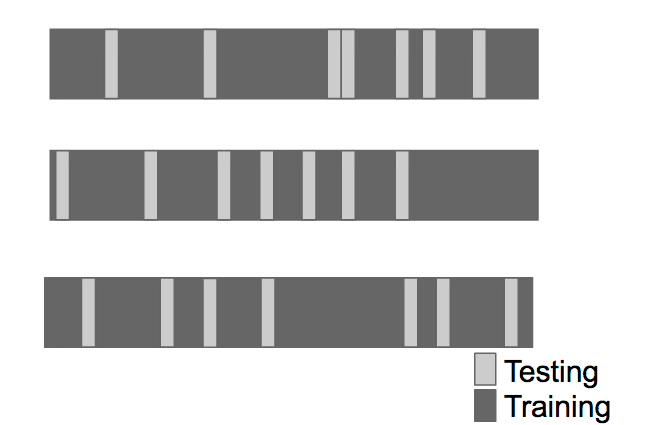

```{r setup, include=FALSE}
knitr::opts_chunk$set(echo = TRUE)
```

# Intro  
* This course covers the basic ideas behind machine learning/prediction  
  + Study Design - training vs. test sets  
  + Conceptual issues - out of sample error, overfitting, ROC curves  
  + Practical Implementation - the caret package  
* What this course depends on:  
  + The Data Scientist's Toolbox  
  + R Programming  
* What would be useful  
  + Exploratory Analysis  
  + Reproducible Research  
  + Regression Models  
  + (Notes on these 5 courses are all in my GitHub repoes)  
  
## GitHub Link for Lectures  
**[Practical Machine Learning lectures on GitHub](https://github.com/bcaffo/courses/tree/master/08_PracticalMachineLearning)**  

## Course Book  
**[The book for this course is available on this site](https://web.stanford.edu/~hastie/ElemStatLearn//)**  

## Instructor's Note  
"*Welcome to Practical Machine Learning! This course will focus on developing the tools and techniques for understanding, building, and testing prediction functions.*  
  
*These tools are at the center of the Data Science revolution. Many researchers, companies, and governmental organizations would like to use the cheap and abundant data they are collecting to predict what customers will like, what services to offer, or how to improve people's lives.*  
  
*Jeff Leek and the Data Science Track Team*"  


# Prediction, Errors, and Cross Validation  
## Prediction  
### Prediction Motivation  
* Who predicts things?  
  + Local governments -> pension payments  
  + Google -> whether you will click on an ad  
  + Amazon -> what movies you will watch  
  + Insurance companies -> what your risk of death is  
  + Johns Hopkins -> who will succeed in their programs  
* Why predict things  
  + Glory (Nerd cred for accomplishing certain feats)  
    - A lot of competitions are hosted on **[Kaggle](http://www.kaggle.com/)**  
  + Riches (Completing some competition that offers a reward)  
  + Save lives  
    - **[On cotype DX](http://www.oncotypedx.com/en-US/Home)** reveals the underlying biology that changes treatment decisions 37% of the time.  

#### More Resources
* **[A course on more advanced material about ML](https://www.coursera.org/course/ml)**  
* **[List of machine learning resources on Quora](http://www.quora.com/Machine-Learning/What-are-some-good-resources-for-learning-about-machine-learning-Why)**  
* **[List of machine learning resources from Science](http://www.sciencemag.org/site/feature/data/compsci/machine_learning.xhtml)**  
* **[Advanced notes from MIT open courseware](http://ocw.mit.edu/courses/electrical-engineering-and-computer-science/6-867-machine-learning-fall-2006/lecture-notes/)**  
* **[Advanced notes from CMU](http://www.stat.cmu.edu/~cshalizi/350/)**  
* **[Kaggle - machine learning competitions](http://www.kaggle.com/)**  

### What is Prediction?  
#### Main Idea  
* One focus of ML is on what algorithms are the best for extracting information and using it to predict.  
* Although the method used for producing a training set is also quite important  

  
* One starts off with a dataset  
1) One uses Probability/Sampling to select a Training Set  
2) One measures characteristics of this training set to create a Predicition Function  
3) One then uses the Prediction Function to take an uncolored dot and predict if it's red or blue  
4) One would then go on to test how well their Prediction Function works  

#### What Can Go Wrong  
* An example is **[Google Flu trends](http://www.sciencemag.org/content/343/6176/1203)** (**[A free overview of the issue witht he accuracy](https://en.wikipedia.org/wiki/Google_Flu_Trends#Accuracy)**)  
  - Google tried to predict rate of flu using what people would search  
  - Originally the algorithm was able to represent how many cases would appear in a region within a certain time  
  - Although they didn't account for the fact that the terms would change over time  
  - The way the terms were being used wasn't well understood so when terms changed they weren't able to accurately account for the change.  
  - It also overestimated as it the search terms it looked at were often cofactors with other illnesses  
  
#### Componets of a Predictor  
1) Question  
* Any problem in data science starts with a question, "What are you trying to predict and what are you trying to predict it with?"  

2) Input Data  
* Collect best input data you can to use to predict  

3) Features  
* From that data one builds features that they will use to predict  

4) Algorithm  
* One uses ML algorithms to develop a function  

5) Parameters  
* Estimate parameters of the algorithm  

6) Evaluation  
* Apply algorithm to a data set to evaluate how well the algorithm works  

#### Example  
* Start with a general question, "Can I automatically detect emails that are SPAM and those that are not?"  
* Make the question more concrete, "Can I use quantitative characteristics of the emails to classify them as SPAM/HAM?"  
* Find input data  
  + In this instance there is data avaliable in R via the `kernlab` package  
  + Note that this data set won't necessarily be the perfect data as it doesn't contain all the emails ever sent, or the emails sent to you personally  
* Quantify features, such as the frequency of certain words or typeface. The `spam` dataset from `kernlab` contains these types of frequency.  
```{r}
library(kernlab)
data(spam)
str(spam)
```
```{r}
plot(density(spam$your[spam$type=="nonspam"]),
     col = "#5BC2E7", main = "", xlab = "Frequency of 'your'")
lines(density(spam$your[spam$type=="spam"]), col = "#FF0000")
```
  
 * It can be seen here "your" appears more often in SPAM emails than it does in HAM  
  + One could use this idea to create a cut-off point for predicting if a message is SPAM  
* The proposed algorithm  
  + Find a value of $C$  
  + If the frequency of $'your'>C$ predict the message is SPAM  
```{r}
plot(density(spam$your[spam$type=="nonspam"]),
     col = "#5BC2E7", main = "", xlab = "Frequency of 'your'")
lines(density(spam$your[spam$type=="spam"]), col = "#FF0000")
abline(v = 0.5, col = "#000000")
```
  
* Choosing 0.5 would contain most spam messages and avoid the second spike of HAM emails  
* We then evaluate this predictor  
```{r}
prediction <- ifelse(spam$your > 0.5, "spam", "nonspam")
res <- table(prediction, spam$type)/length(spam$type)
res
```
  
* In this case our accuracy is `r round(res[1,1], 4)` + `r round(res[2,2], 4)` = `r round(res[1,1]+res[2,2], 4)`, or an accuracy of approximately `r round((res[1,1]+res[2,2])*100, 2)`%, although this is an opptamistic measure of the overall error, which will be discussed further later.    


### Relative Importance of Steps  
question > data > features/variables > algorithms  
"*The commbinaiton of some data and an aching desire for an answer does not ensure that a reasonable answer can be extracted from a given body of data.*" -John Tukey  

* In other words, an important component of prediction is knowing when to give up, that is that the data is not sufficient  

#### Input Data: Garbage in = Garbage out  
1. May be easy (movie ratings -> new movie ratings)  
2. May be harder (gene expression data -> disease)  
3. Depends on what is a "good prediction".  
4. Often more **[data > better models](http://www.youtube.com/watch?v=yvDCzhbjYWs)**  
5. The most important step is collecting the right data  

#### Features: They matter!  
* Properties of good features  
  + Lead to data compression  
  + Retain relevant information  
  + Are created based on expert application knowledge  
* Common mistakes  
  + Trying to automate feature selection (Although they may be automated with care)  
  + Not paying attention to data-specific quirks  
  + Throwing away information unnecessarily  

#### Algorithm: They Matter Less Than You'd Think  
  
  
* The above table shows that the Linear Discrimenate Analysis (Lindisc) error often was not that far off from the best method  
* Using the best approach doesn't always largely improve the error  

#### Issues to Consider  
* The "Best" machine learning method would be:  
  + Interpretable  
    - If predictor is to be presented to an uninformed audience you'd want to to be understandable by them  
  + Simple  
    - Helps with interpretablity  
  + Accurate  
    - Getting a model to be interpretable can sometimes hurt the accuracy  
  + Fast  
    - Quick build the model, train, and test  
  + Scalable  
    - Easy to apply to a large dataset (either fast or parallelizable)  

#### Prediction is About Accuracy Tradeoffs  
* Tradeoffs are made for interpretability, speed, simplicity, or scalability.  
* Interpretability matters, decision tree-like results are more interpretable
  + "**if** total cholesterol $\geq 160$ **and** they smoke **then** *10 year CHD risk* $\geq$ *5%* **else if** they smoke **and** systolic blood pressure $\geq$ 140 **then** *10 year CHD risk* $\geq$ 5% **else** *10 year CHD risk* < 5%"  
* Scalability matter  
  + in "The Netflix $1 Million Challenge" Netflix never implemented the solution itself because the algorithm wasn't scalable and took way too long on the big data sets that Neflix was working with, so they went with something that was less accurate but more scalable.  


## Errors  
### In and Out of Sample Errors  
* **In Sample Error** - Sometimes called *resubstitution error*. The error rate you get on the same data set you used to build your predictor.  
* **Out of Sample Error** - Sometimes called *generalization error*. The error rate you get on a new data set.  
* Key Ideas  
1) Out of sample error is what you care about  
2) In sample error < out of sample error  
  + Sometimes you want to give up some accuracy on the data you have to have greater accuracy on unkown data.  
3) The reason is overfitting  
  + Matching your algorithm to the noise of the data you have  

#### Spam Example  
```{r warning = FALSE}
library(kernlab)
data(spam)
RNGkind(sample.kind = "Rounding")
set.seed(333)
smallSpam <- spam[sample(dim(spam)[1], size = 10),]
spamLabel <- (smallSpam$type == "spam")*1 + 1
plot(smallSpam$capitalAve, col = spamLabel, pch = 3)
abline(h = 2.7, col = "#FF0000")
abline(h = 2.40, col = "#000000")
abline(h = 2.80, col = "#5BC2E7")
```
  
##### Prediction 1  
* capitalAve > 2.7 = "spam"  
* capitalAve < 2.40 = "nonspam"
* We can add 2 params to make the prediction perfect for the training set  
  + capitalAve between 2.40 and 2.45 = "spam"  
  + capitalAve between 2.45 and 2.7 = "nonspam"  
```{r}
rule1 <- function(x){
  prediction <- rep(NA, length(x))
  prediction[x > 2.7] <- "spam"
  prediction[x < 2.40] <- "nonspam"
  prediction[(x >= 2.40 & x <= 2.45)] <- "spam"
  prediction[(x > 2.45 & x <= 2.70)] <- "nonspam"
  return(prediction)
}
table(rule1(smallSpam$capitalAve),smallSpam$type)
```

##### Prediction 2  
* (Note: The blue line in the plot is for 2.8)
* capitalAve > 2.80 = "spam"  
* capitalAve $\leq$ 2.80 = "nonspam"  
* This algorithm won't be perfect on the training data  
```{r}
rule2 <- function(x){
  prediction <- rep(NA, length(x))
  prediction[x > 2.8] <- "spam"
  prediction[x <= 2.8] <- "nonspam"
  return(prediction)
}
table(rule2(smallSpam$capitalAve), smallSpam$type)
```

##### Apply 2 rulesets to all spam data  
```{r}
table(rule1(spam$capitalAve),spam$type)
table(rule2(spam$capitalAve),spam$type)
paste0("Rule 1 accuracy: ", 
       mean(rule1(spam$capitalAve) == spam$type))
paste0("Rule 2 accuracy: ", 
       mean(rule2(spam$capitalAve) == spam$type))
paste0("Rule 1 total correct: ",
       sum(rule1(spam$capitalAve) == spam$type))
paste0("Rule 2 total correct: ",
       sum(rule2(spam$capitalAve) == spam$type))
```
  
#### Overfitting  
* Why is the ruleset with a *better* out of sample error (`rule2`) the one with a *worse* in sample error?  
  + It's because we overfitted `rule1` 
  + **[Wikipedia on Overfitting](http://en.wikipedia.org/wiki/Overfitting)**
* All data have two parts  
  + Signal - Part we are trying to use to predict  
  + Noise - Random variation in data set  
* The goal of a predictor is to find the signal and ignore the noise  
* You can always design a perfect in-sample predictor  
  + Doing this will capture botht he signal and the noise  
  + As such a predictor won't perform as well on new samples  
  
### Prediction Study Design  
1) Define your error rate  
2) Split data into:  
* Training set to build model  
* Testing set to validate model  
* Validation set (optional) to also validate the model  
3) On the training set pick features (using cross-validation to pick which features are most important in your model)  
4) On the training set pick prediction function (also using cross-validation)  
5a) If no validation set: 
* Apply the best model to the test set exactly 1 time  
  + If we apply multiple models to the test set and pick the best one we're kind of using the test set to train the model, giving an optimistic error rate  
5b) If there is a validation set: 
* Apply the model the the test set and refine the model  
* Then apply best model to validation set once  

#### Benchmarks  
* One should know what the prediction benchmarks are for their algorithm to help troubleshoot when something is going wrong. Often a benchmark is something like "all zeros" which tells the error rate if all values were set to 0, pretty much just ignore all the features of the dataset and taking a general average.  

#### Study Design of Netflix Contest  

  
* Of all the data they split it into a training set (*Training Data*) that they shared with competators and a test & validation set (*Held Out Set*)that they did not share.  
* They shared a test set (*Probe*) so competators could test their out of sample error.  
* They would then take your model and test it on the *Quiz* set, although one could submit multiple models and get a scoring from the *Quiz* set. So they held out the last bit of data as a validation set (*Test*) that would be used at the end of the competition on each model only once.  

#### Avoid Small Sample Sizes  
* Suppose you are predicting a binary outcome  
  + Diseased/healthy  
  + (Not) Clicking on an ad  
* One classifier is flipping a coin  
* Probability of perfect classification is approximately $(\frac{1}{2})^{sample\space size}$  
  + $n = 1$ flipping coin 50% change of 100% accuracy  
  + $n = 2$ flipping coin 25% change of 100% accuracy  
  + $n = 10$ flipping coin 0.10% change of 100% accuracy  
* So lower sample sizes make it harder to know if your high accuracy is from chance or true.  

#### Rules of Thumb for Prediction Study Design  
* If you have a large sample size  
  + 60% training  
  + 20% test  
  + 20% validation  
* If you have a medium smaple size  
  + 60% training  
  + 40% testing  
* If you have a small sample size  
  + Do cross validation  
  + Reprot caveat of small sample size  

#### Some Principles to Remember  
* Set the test/validation set aside and *don't look at it*  
* In general *randomly* sample training and test sets  
* Your data sets must reflect structure of the problem  
  + If predictions evolve with time split train/test in time chunks (called backtesting in finance)  
* All subsets should reflect as much diversity as possible  
  + Random assignment does this  
  + You can also try to balance by features - but this is tricky  
  

### Types of Errors  
#### Basic Terms  
In general, **Positive** = identified and **Negative** = rejected. Whereas **True** and **False** indicate correctness. Therefore:  
* **True positive** = correctly identified  
* **False positive** = incorrectly identified  
* **True negative** = correctly rejected  
* **False negative** = incorrectly rejected  
  
*Medical testing example:*  
* **True positive** = Sick people correctly diagnosed as sick  
* **False positive** = Healthy people incorrectly identified as sick  
* **True negative** = Healthy people correctly identified as healthy  
* **False negative** = Sick people incorrectly identified as healthy  

* Sensitivity and Specificity  
  + **Sensitivity** - **True Positve Rate**, *Pr(positive test|disease)*, proportion of actual positives that are correctly identified  
  + **Specificity** - **True Negative Rate**, *Pr(negative test|no disease)* proportion of actual negatives that are correctly identified  
  + High amount of either ussually entails a high amount of the False ... Rate of the respective type, as ensuring you get all the positive/negative usually means you have to include some of the respective false samples.  
  + Sensitivity is likely to diagnois a positive (**Sen**tence the innocent)  
  + Specificity is going to be sure the positives are positive, even if they miss some (**Sp**are the innocent)  
* Other key quantities  
  + **Positive Predictive Value** - *Pr(disease|positive test)*  
  + **Negative Predictive Value** - *Pr(no disease | negative test)*  
  + **Accuracy** - *Pr(correct outcome)* = *Pr(positive test|disease) + Pr(negative test|no disease)*  

##### Key Quantities as Fractions  
```{r echo = FALSE}
tbl <- data.frame(Actually_Positive = c("TP", "FN"), 
           Actually_Negative = c("FP", "TN"))
row.names(tbl) <- c("Tested_Postive", "Tested_Negative")
tbl
```
  
* Sensitivity = $\frac{TP}{(TP+FN)}$  
* Specificity = $\frac{TN}{(FP+TN)}$  
* Positive Predictive Value = $\frac{TP}{(TP+FP)}$  
* Negative Predictive Value = $\frac{TN}{(FN+TN)}$  
* Accuracy = $\frac{(TP+TN)}{(TP+FP+FN+TN)}$  

#### Screening Tests Example  
Assume that some disease has a 0.1% prevalence in the population. Assume we have a test kit for that disease that works with 99% sensitivity and 99% specificity. What is the probability of a person having the disease given the test result is positive, if we randomly select a subject from:  
(We'll look at the expected values if we sampled 100000 people) 
* The general population?  
```{r echo=FALSE}
tbl[,1] <- c(99,1)
tbl[,2] <- c(999, 98901)
tbl
```
  
  + Sensitivity = $\frac{99}{(99+1)}$ = `r (99/(99+1))*100`%  
  + Specificity = $\frac{98901}{(999+98901)}$ = `r (98901/(999+98901))*100`%  
  + Positive Predictive Value = $\frac{99}{(99+999)}$ = `r round(((99)/(99+999))*100, 3)`%  
  + Negative Predictive Value = $\frac{98901}{(1+98901)}$ = `r round((98901/(1+98901))*100, 3)`%  
  + Accuracy = $\frac{(99+98901)}{100000}$ = `r ((99+98901)/100000)*100`%  

* A high risk sub-population with 10% disease prevalence  
```{r echo=FALSE}
tbl[,1] <- c(9900, 100)
tbl[,2] <- c(900, 89100)
tbl
```
  
  + Sensitivity = $\frac{9900}{(9900+100)}$ = `r (9900/(9900+100))*100`%  
  + Specificity = $\frac{89100}{(900+89100)}$ = `r (89100/(900+89100))*100`%  
  + Positive Predictive Value = $\frac{9900}{(9900+900)}$ = `r round(((9900)/(9900+900))*100, 3)`%  
  + Negative Predictive Value = $\frac{89100}{(100+89100)}$ = `r round((89100/(100+89100))*100, 3)`%  
  + Accuracy = $\frac{(9900+89100)}{100000}$ = `r ((9900+89100)/100000)*100`%  
 
* This low Postitive Predictive Value shows the issues with predicting a very rare event from a population versus something that's more prevalent.  

#### For Continous Data  
We evaluate error by *mean squared error* and it's root  
* **Mean squared error (MSE)** - $\frac{1}{n}\sum_{i=1}^n(Prediction_i-Truth_i)^2$  
* **Root mean squared error (RMSE)** - $\sqrt{\frac{1}{n}\sum_{i=1}^n(Prediction_i-Truth_i)^2}$  

#### Common Error Measures  
1. Mean squared error (or root mean squared error)  
* Continous data, sensitive to outliers  
2. Median absolute deviation  
* Median of distance between predicted and observed and take absolute value, rather than squared distance (this requries all values to be positive).  
* Continous data, often more robust  
3. Sensitivity (recall)  
* If you want few missed positives  
4. Specificity  
* If you want few negatives called positives  
5. Accuracy  
* Weights false positives/negatives equally  
6. Concordance  
* An example is **[kappa](https://en.wikipedia.org/wiki/Cohen%27s_kappa)**  
7. Predictive value of a positive (precision)  
* When you are screening and prevalence is low  


### Receiver Operating Characteristics (ROC Curves)   
* Used to meaure the quality of a prediction algorithm  
* **[Wikipedia](https://en.wikipedia.org/wiki/Receiver_operating_characteristic)**
* Predictions are often quantitative  
  + Proabbility fo being alive  
  + Prediction on a scale from 1 to 10  
* The *cutoff* you choose gives different results  
* The curve informs you of the tradeoff of giving up some specificity for sensitivity (or vice versa)  
* The curves plot the $P(FP)$ (x-axis) versus $P(TP)$ (y-axis)  
  
  
#### Area Under the Curve  
* The area under the curve (AKA the integral) describes the effectiveness of a given algorithm  
* AUC = 0.5: random guessing  
* AUC = 1: perfect classifier (given a certain value of the perdiction algorithm)  
  + As such the closer to the top left of the plot a curve is the better it is.  
* In general (depending on field & probability) an AUC above 0.8 is considered "good"  

## Cross Validation  
### Cross Validation  
* A widely used tool for detecting relevant features and building models.  

#### Key Ideas  
1. Accuracy on the training set (resubstitution accuracy) is optimistic  
2. A better estimate comes from an independent set (test set accuracy)  
3. But we can't use the test set when building the model or it becomems part of the training set  
4. So we estimate the test set accuracy with the training set  

Cross-Validation Approach:  
1. Use the training set  
2. Split it into training/test sets (seperate from actual test set)  
3. Build a model on the training set  
4. Evaluate on the test set  
5. Repeat with new training/test sets and average the estimated errors  
  
What Cross-Validation is used for:  
1. Picking variables to include in a model  
2. Picking th etype of prediction function to use  
3. Picking the parameters in the prediction function  
4. Comparing different predictors  
  
#### Ways to Pick Subsets  

  
  
  
* Breaks data into $K$ equal sized data sets.  

  
  
* Leave out 1 sample then train on all the others, repeat for all samples  

#### Considerations  
* For time series data, data must be used in "chunks"  
* For k-fold cross validation  
  + Larger k = less bias, more variance  
  + Smaller k = more bias, less variance  
* Random sampling must be done *without replacement*  
* Random sampling with replacement is the *bootstrap*  
  + Underestimates of the error  
  + Can be corrected, but it is complicated (**[0.632 Bootstrap](https://www.jstor.org/stable/2965703?seq=1)**)  
* If you cross-validate to pick predictors estimate you must estiamte errors on independent data.  


### What Data Should You Use?  
* If you want to predict something about *X* use data related to *X* (Use like to predict like)  
  + To predict player performance use data about player performance  
  + To predict movie preferences use data about movie preferences  
  + To predict hospitalizations sue data about hospitalizations  
* The closer the data is to the process you want to predict the better the predictions will be  
* The looser connection the harder the prediction may be  
  + *On Cotype DX* uses gene expression to predict one's longevity and effectiveness of treatments for those with breast cancer.  
* Unrelated data is the most common mistake, **[for example:](http://www.nejm.org/doi/full/10.1056/NEJMon1211064)**  

  
  + There are many alternate variables one could look at that are more realisticly correlated  

## Quiz 1  
(Note 1-4 were multiple choice of material covered in the notes)  

5. Suppose that we have created a machine learning algorithm that predicts whether a link will be clicked with 99% sensitivity and 99% specificity. The rate the link is clicked is 1/1000 of visits to a website. If we predict the link will be clicked on a specific visit, what is the probability it will actually be clicked?

```{r}
sens <- 0.99  #TP/(TP+FN)
spec <- 0.99  #TN/(FP+TN)
rate <- 1/1000 #sum(TP+FN), 1-r is sum(FP+TN)  
#ppv = TP/(TP + FP)

#rate = TP+FN,
#rate - TP = FN
#sens * (TP+FN) = TP,
#sens * (TP + rate - TP) = TP,
#TP = sens * rate
TP <- sens * rate

#1 - rate = FP + TN,
#1 - rate - FP = TN

#spec * (FP+TN) = TN,
#spec * (FP+1 - rate - FP) = 1 - rate - FP
#spec * (1 - rate) = 1 - rate - FP
# FP = 1 - rate - (spec* (1-rate))
# FP = (1-rate)*(1-spec)
FP <- (1-rate)*(1-spec)
ppv <- TP/(TP + FP)
ppv
```


# The Caret Package  
## Caret Package  
### Caret Package  
* Can be installed with `install.packages("caret")`, details about the package **[can be found on cran](https://cran.r-project.org/web/packages/caret/index.html)**  

#### Functionality  
* Some preprocessing (cleaning)  
  + `preProcess`  
* Data splitting  
  + `createDataPartition`  
  + `createResample`  
  + `createTimeSlices`  
* Training/testing functions  
  + `train`  
  + `predict`  
* Model comparison  
  + `confusionMatrix`  
  
#### Machine Learning Algorithms in Base R  
* Linear discriminant analysis  
* Regression  
* Naive Bayes  
* Support vector machines  
* Classification and regression trees  
* Random forests  
* Boosting  
* etc.  
* The interface for these algorithms is slightly different  
  
  
* The `caret` package unifies these differences  

#### SPAM Example: Data Splitting  
```{r}
library(caret)
library(kernlab) #For data 
data(spam)
set.seed(32343)
inTrain <- createDataPartition(y = spam$type,
                               p = 0.75, #Proportion to subset
                               list = FALSE) # =F returns indecies 
training <- spam[inTrain, ]
testing <- spam[-inTrain, ]
dim(spam)
dim(training)
dim(spam)[1]*0.75 #Showing it took 75%
```

```{r warning = FALSE}
set.seed(32343)
modelFit <- train(type ~ ., data = training, method = "glm")
modelFit
```
  
* `Resampling: Bootstrapped (25 reps)` indicates that it used the Bootstrap method, with 25 replicates. It corrects for the error that can occur when using the bootstrap method  
```{r}
modelFit$finalModel
```
  
* This shows all how all the variables are weighted  

#### SPAM Example: Prediction  
```{r}
predictions <- predict(modelFit, newdata = testing)
predictions[1:30]
```

#### SPAM Example: Confusion Matrix  
```{r}
confusionMatrix(predictions, testing$type)
```

* First gives a table of the predicted vs. true value  
* Gives summary statistics  
  + Accuracy & 95% CI for the accuracy  
  + No Information Rate is the average loss, $L$, of $f$ over all combinations of $y_i$ and $x_j$, expressed with the formula: $\frac{1}{n^2}\sum_{i=1}^n\sum_{j=1}^nL(y_i,f(x_j))$  
  + The **[Mcnemar's Test P-Value](https://en.wikipedia.org/wiki/McNemar%27s_test)** has a null hypothesis that the error rates are equivelant  
  
#### Further Information  
* Caret tutorials:
  + **[PDF caret tutorial](http://www.edii.uclm.es/~useR-2013/Tutorials/kuhn/user_caret_2up.pdf)**
  + **[cran vignette PDF ](http://cran.r-project.org/web/packages/caret/vignettes/caret.pdf)**
  + **[A paper introducing the caret package](http://www.jstatsoft.org/v28/i05/paper)**

### Data Slicing  
#### SPAM Example: Data Splitting  
```{r}
library(caret)
library(kernlab); data(spam)
inTrain <- createDataPartition(y = spam$type, 
                               p = 0.75, list = FALSE)
training <- spam[inTrain, ]
testing <- spam[-inTrain, ]
```

#### SPAM Example: K-fold  
```{r}
set.seed(32323)
folds <- createFolds(y=spam$type, k = 10,
                    list = TRUE, returnTrain = TRUE) #Returns sample positions
sapply(folds, length)
folds[[1]][1:10]

#You can also have it return the test set
set.seed(32323)
folds <- createFolds(y=spam$type, k = 10,
                    list = TRUE, returnTrain = FALSE) #Returns sample positions
sapply(folds, length)
folds[[1]][1:10]

```

#### SPAM Example: Resampling  
```{r}
set.seed(32323)
folds <- createResample(y = spam$type, times = 10,
                        list = TRUE)
sapply(folds, length)
folds[[1]][1:10] #Contains some resampled values
```

#### SPAM Example: Time Slices  
```{r}
set.seed(32323)
tme <- 1:1000
folds <- createTimeSlices(y = tme, 
                          initialWindow = 20, #consecutive ... training set 
                          horizon = 10)#Consecutive values in each test set
names(folds)
folds$train[[1]]
folds$test[[1]]
```


### Training Options  
```{r warning=FALSE}
## Still using SPAM set  
library(caret)
library(kernlab); data(spam)
inTrain <- createDataPartition(y = spam$type, p = 0.75, list = FALSE)
training <- spam[inTrain, ]
testing <- spam[-inTrain, ]
modelFit <- train(type ~., data = training, method = "glm")
```

#### Train Options  
```{r}
args(caret:::train.default)
```
  
* One can change ...  
  + `preProcess` to change preprocessing options (covered later)  
  + `weights` to assign weights to the variables (Useful for unbalanced training set)  
  + `metric` to change what is measured, default is that Accuracy is measured for catagorigal variables and RMSE otherwise. Below are some of the other options:  
    - RMSE = Root mean squared error  
    - RSquared = $R^2$ from regression models  
    - Accuracy = Fraction correct  
    - Kappa = A measure of **[concordance](http://en.wikipedia.org/wiki/Cohen%27s_kappa)**    
    
  + `trControl` = Calls to `trainControl` function which has more of it's own settings:  
```{r}
args(trainControl)
```
    - `method` will determine how it samples data, along with the `number` of times and how many the process `repeats`.  
    - `initialWindow` and `horizon` is for time based data  
    - `savePredictions` if true will return all the predictors of each model  
    - `summaryFunction` will determine the kind of summary returned  
    - `preProcOptions` (Preprocessing options)  
    - `seeds` is available to set seeds for all the diffrent resampling layers, helpful when running in parallel. Often useful to set an overall seed outside this argument.
    
#### trainControl Resampling  
* `method`  
  + *boot* = bootstrapping  
  + *boot632* = bootstrapping with adjustment  
  + *cv* = cross validation  
  + *repeatedcv* = repeated cross validation  
  + *LOOCV* = leave one out cross validation  
* `number`  
  + For boot/cross validation  
  + Number of subsamples to take  
* `repeats`  
  + Number of times to repeat subsampling  
  + If value is big this can slow things down  
  
* **[More info on model training and tuning](http://caret.r-forge.r-project.org/training.html)**  


### Plotting Predictors  
```{r message = FALSE}
#The example in this lesson will be using wages data from the ISLR package  
library(ISLR); data(Wage)
library(tidyverse)
library(caret)
summary(Wage)
```
  
* From this we can see the data is all from Males in the Middle Atlantic region  
```{r}
## Creating training/test sets  
set.seed(1618033)
inTrain <- createDataPartition(y = Wage$wage,
                               p = 0.7, list = FALSE)
training <- Wage[inTrain, ]
testing <- Wage[-inTrain, ]
dim(training); dim(testing)
```

#### Looking at the Data  
##### featurePlot  
```{r}
featurePlot(x = training[, c("age", "education", "jobclass")],
            y = training$wage,
            plot = "pairs")
```

* When looking at this plot one is looking for trends in the data, for example the second column of the first row shows a semi-positive correlation to the X, when deciphering the mess of words one can see this is our y, `wage`, against `education`; indicating higher education might correlate to a higher wage.  
* Two catagorical variables against eachother are hard to decipher meaning from as they largely overlap.  

##### qplot  
* Quick plots in style of `ggplot`  
```{r}
qplot(age, wage, data = training)
```

* The odd subset of wages that are away from the others may be cause for some concern, as such we'd want to investigate this before making the model  
```{r}
qplot(age, wage, colour = jobclass, data = training)
```

* You can also add regression smoothers to investigate differences more  
```{r}
plot <- qplot(age, wage, colour = education, data = training)
plot + geom_smooth(method = 'lm', formula = y ~ x)
```

##### Using cut2 to make factors  
```{r warning = FALSE}
library(Hmisc)
cutWage <- cut2(training$wage, g = 3)
table(cutWage)
```
```{r}
bplot1 <- qplot(cutWage, age, data = training, fill = cutWage,
               geom = c("boxplot"))
bplot1
```

```{r}
#Add points overlayed on boxplot
bplot2 <- qplot(cutWage, age, data = training, fill = cutWage, 
                geom = c("boxplot", "jitter"))
bplot2
```

* Many points for each plot indicates the boxplots are well representing the data, if there were only a few then it would suggest the boxplots are not as representative  

##### Tables  
```{r}
t1 <- table(cutWage, training$jobclass)
t1
prop.table(t1, 1) #Shows proportions, 1 for by row
```

##### Density Plots  
```{r}
qplot(wage, colour = education, data = training, geom = "density")
```

#### Notes and Further Reading  
* Make your plots only in the training set  
  + Don't use the test set for exploration!  
* Things one should be looking for  
  + Imbalance in outcomes/predictors  
  + Outliers  
  + Groups of points not explained by a predictor  
  + Skewed variables  
* **[ggplot2 tutorial](http://rstudio-pubs-static.s3.amazonaws.com/2176_75884214fc524dc0bc2a140573da38bb.html)**  
* **[caret visualizations](http://caret.r-forge.r-project.org/visualizations.html)**  


## Preprocessing  
### Basic Preprocessing  
* Sometimes variables need to be transformed to be more helpful for prediction algorithms  

#### Why Preprocess? : Looking at SPAM Example  
```{r}
library(kernlab); data(spam)
library(caret)
set.seed(1618033)
inTrain <- createDataPartition(y = spam$type,
                               p = 0.75, list = FALSE)
training <- spam[inTrain, ]
testing <- spam[-inTrain, ]
hist(training$capitalAve, main = "", xlab = "Ave. Capital Run Length")
```

* There are a few lengths that are large causing this overall distribution to be quite skewed, so you may want to standardize the variable. This can be seen because of the large standard deviation, `r round(sd(training$capitalAve), 2)`.  

#### Standardizing  
* Subtract the mean from each variable then divide by the sd.  
```{r}
trainCapAve <- training$capitalAve
trainCapAveS <- (trainCapAve - mean(trainCapAve))/sd(trainCapAve)
mean(trainCapAveS)
sd(trainCapAveS)
```
* Standardizing a data set will make the mean nearly 0 and the sd 1 as it's now measuring z-scores  
* When evaluating on the test set one can only use parameters that were estiamted from the training set. In other words when we standardize the testing set with have to use the mean & sd of the training set. This will result in the mean and sd not be 1 and 0, respectively.  
```{r}
testCapAve <- testing$capitalAve
testCapAveS <- (testCapAve -
                  mean(trainCapAve))/sd(trainCapAve)
mean(testCapAveS)
sd(testCapAveS)
```

##### Standardizing with preProcess Function  
```{r}
preObj <- preProcess(training[,-58], #Passing all variables except SPAM/HAM
                     method = c("center", #Subtracts mean
                                "scale")) #Divides by sd
trainCapAveS <- predict(preObj, training[,-58])$capitalAve
mean(trainCapAveS)
sd(trainCapAveS)
```
* You can then use this object returned by `preProcess` to pre process the test set  
```{r}
testCapAveS <- predict(preObj, testing[,-58])$capitalAve
mean(testCapAveS)
sd(testCapAveS)
```

##### Standardizing with preProcess Argument  
```{r warning = FALSE}
set.seed(32343)
modelFit <- train(type ~., data = training,
                  preProcess = c("center", "scale"), 
                  method = "glm")
modelFit
```

##### Standardizing - Box-Cox Transforms  
* BoxCox transforms are a set of transforms that take continous data and try to make them look like normal data. They do this by estimating a set of parameters based on maximum likelyhood  
```{r}
preObj <- preProcess(training[,-58], method = c("BoxCox"))
trainCapAveS <- predict(preObj, training[,-58])$capitalAve
par(mfrow = c(1,2))
hist(trainCapAveS); qqnorm(trainCapAveS)
```
  
* Note that there are still a stack of values at or around 0  
  + This is because BoxCox does not take care of repeated variables  

#### Imputing Data  
```{r}
set.seed(13343)

# Creating some NA values  
training$capAve <- training$capitalAve
selectNA <- rbinom(dim(training)[1], size=1, prob = 0.05) == 1
training$capAve[selectNA] <- NA

# Impute and standardize  
preObj <- preProcess(training[,-58], 
                     method = "knnImpute") #K Nearest Neighbors Impute
capAve <- predict(preObj, training[,-58])$capAve

# Standardize true values  
capAveTruth <- training$capitalAve
capAveTruth <- (capAveTruth - mean(capAveTruth))/sd(capAveTruth)

# How close was the imputting
quantile(capAve - capAveTruth)  #all
quantile((capAve - capAveTruth)[selectNA]) #only missing value
quantile((capAve - capAveTruth)[!selectNA]) #exclude missing
```

#### Notes & Further Reading  
* Training and test sets must be pre-processed in the same way  
* Test transformations will likely be imperfect  
  + Especially if the test/training sets are collected at different times or in different ways  
* Careful when transforming factor variables!  
* **[preprocessing with caret](http://caret.r-forge.r-project.org/preprocess.html)**  

### Covariate Creation  
* Covariates are also called *predictors* or *features*, they are what variables are used and combined to predict the outcome you're looking at.  
* The raw data usually takes form of an image or text file so you want to turn that into a quantifiable predictor. The goal is to describe the data as much as possible while also compressing the key components of the data. In spam example we look at things like:  
  + Proportion of capital letters, `capitalAve`
  + Frequency of a given word, `you`, or character, `numDollar` (dollar signs).
* Sometimes after collecting the variables we want to transform the data to a more useful value, like squaring a value.  

#### Level 1, Raw Data -> Covariates  
* Depends heavily on application  
* The balancing act is summarization vs. information loss  
* Examples:  
  + Text files: frequency fo words, frequency of phrases (**[Google ngrams](https://books.google.com/ngrams)**), frequency of capital letters.  
  + Images: Edges, corners, blobs, ridges (**[computer vision feature detection](https://bit.ly/2VWq2Id)**)  
  + Webpages: Number and type of images, position fo elements, colors, videos (**[A/B Testing](http://en.wikipedia.org/wiki/A/B_testing)**)  
  + People: Height, weight, hair color, sex, country of orgin.  
* The more knowledge of the system you have the better the job you will do at extracting features.  
* When in doubt, err on the side of more features  
* Can be automated, but use caution!  

#### Level 2, Tidy Covariates -> New Covariates  
* More necessary for some methods (regression, support vector machines (svms)) than for others (classification trees).  
* Deciding how to create them should be done *only on the training set*  
  + When applying the prediction you'll make these same mutations  
* The best approach is through exploratory analysis (plotting/tables)  
* New covariates should be added to data frames with recognizable names  

#### Wage Example  
```{r}
library(caret)
library(ISLR); data(Wage)
set.seed(1618033)
inTrain <- createDataPartition(y = Wage$wage,
                               p = 0.7, list = FALSE)
training <- Wage[inTrain, ]
testing <- Wage[-inTrain, ]
```

##### Adding "Dummy Variables"  
```{r}
table(training$jobclass)
```
* Since jobs are either `Industrial` or `Information` we may want to melt this factor variable into two seperate logical columns  
```{r}
dummies <- dummyVars(wage ~ jobclass, data = training)
head(predict(dummies, newdata = training))
```

##### Removing Zero Covariates  
```{r}
nsv <- nearZeroVar(training, saveMetrics = TRUE)
nsv
```

* A `freqRatio` near 0 indicates that it rarely has a unique value.  
* `TRUE` in either `zeroVar` or `nzv` indicates that you likely can remove that variable without losing any context.  

##### Spline Basis  
```{r}
library(splines)
bsBasis <- bs(training$age, df = 3)
head(bsBasis,16)
```
  
* `bs` is a basis function that creates a polynomial variables of the `df` degree, with each column being a higher order.  
* Including these covariates allows for more curved of a model fit  
```{r}
lm1 <- lm(wage ~ bsBasis, data = training)
plot(training$age, training$wage, pch = 10, cex = 0.5)
points(training$age, predict(lm1, newdata = training), col = "#FF0000", pch = 19, cex = 0.5)
```

###### Splines on the Test Set  
* You have to create the predictions on the test set with the exact same percedure you used on the training set.  
* As such we have to predict what the variables of the testing set will be with the prediction from the training set.  
```{r}
predict(bsBasis, age = testing$age)
```

#### Notes and Further Reading  
* Level 1 feature creation (raw data to covariates)  
  + Science is key. Google "feature extraction for [data type]"  
  + Err on overcreation of features, you can always filter them out later in the process.  
  + In some applications (images, voices) automated feature creation is possible/necessary  
  + **[A PDF on deep learning to auto create features for images and voice](http://www.cs.nyu.edu/~yann/talks/lecun-ranzato-icml2013.pdf)**  
* Level 2 feature creation (covariates to new covariates)  
  + The function `preProcess` in `caret` will handle some preprocessing  
  + Create new covariates if you think they will improve fit  
  + Use exploratory analysis on the training set for creating them  
  + Be careful about overfitting!  
* **[preprocessing with caret](http://caret.r-forge.r-project.org/preprocess.html)**  
* If you want to fit spline models, use the `gam` method in the `caret` package which allows smoothing fo multiple variables.  
* More on feature creation/data tidying in the **[Getting and Cleaning Data course](https://github.com/PhiPrime/LassoingDataNotes)**


### Preprocessing with Principal Components Analysis (PCA)  
* Often there will be multiple quantitative variables that are highly correlated, as such one may want to create a summary that contains most of the information from those quantitative variables  

#### Correlated predictors  
```{r}
library(caret)
library(kernlab); data(spam)
set.seed(1618033)
inTrain <- createDataPartition(y = spam$type,
                               p = 0.75, list = FALSE)
training <- spam[inTrain, ]
testing <- spam[-inTrain, ]

M <- abs(cor(training[,-58]))#Remove SPAM/HAM value

#Every variable has a correlation of 
# 1 with itself so we remove those
diag(M) <- 0 
which(M > 0.8, arr.ind = TRUE)
```
* `num415`(col 32) and `num857` (col 34) often appear together. It seems the word `direct` does too but we'll just look at the numbers in this example  
```{r}
rows <- c(34, 32, 40)
n <- names(spam)[rows]
n[1:2]
plot(spam[,rows[1]], spam[,rows[2]], xlab = n[1], ylab = n[2])
```

* Plotting them with eachother shows that they seem to be almost exactly 1-to-1. As such we could probably use less information to convey that both variables are present.  

```{r}
#Looking at plots of that direct variable too
plot(spam[,rows[1]], spam[,rows[3]], xlab = n[1], ylab = n[3])
plot(spam[,rows[2]], spam[,rows[3]], xlab = n[2], ylab = n[3])
```

* `direct` may not be as strongly correlated but seeing the simularity in those two graphs builds a greater case for `num415` and `num857` being highly correlated.  

##### We Could Rotate the Plot  
* We'll be using `0.71` because it is a result from PCA later.  
```{r}
X <- 0.71*training$num415 + 0.71*training$num857
Y <- 0.71*training$num415 - 0.71*training$num857
plot(X,Y)
```
* We can see there is not a lot of variation on the Y axis, the difference  
* Most of the variability occurs on the X axis, the sum, as such we may want to use the sum as a predictor since it captures most of the information from the two variables.  

#### Basic PCA Idea  
* We might not need every predictor  
* A weighted combination fo predictors might be better  
* We should pick this combination to capture the "most information" possible  
* Benefits  
  + Reduced numeber of predictors  
  + Reduced noise (due to averaging)  

##### Related Probelms  
* You have multivariate variables $X_1, ..., X_n$ so $X_1 = (X_{11},...,X_{1m})$  
  + Find a new set of multivariate variables that are uncorrelated and explain as much variance as possible.  
  + If you put all the variables together in one matrix, find the best matrix created with fewer variables (lower rank) that explains the orginal data.  
* The first goal is **statistical** and the second goal is **data compression**.  

#### Related Solutions - PCA/SVD  
* **[I also have notes on this from the Exploratory Data Analysis course](https://github.com/PhiPrime/ExploratoryDataAnalysisNotes)**  
* SVD - Singular Value Decomposition  
  + If $X$ is a matrix with each variable in a column and each observation in a row then the SVD is a "matrix decomposition"  
$X = UDV^T$  
  + Where the columns of $U$ are orthogonal (left singular vectors), the columns of $V$ are orthogonal (right singular vectors) and $D$ is a diagonal matric (singular values).  
* PCA - Principal Component Analysis  
  + The principal components are equal tot eh right singular values if you first scale (subtract the mean, divide by the standard deviation) the variables.  

#### Principal Components in R - prcomp  
```{r}
smallSpam <- spam[,c(34,32)]
prComp <- prcomp(smallSpam)
plot(prComp$x[,1], prComp$x[,2])
```

* We can look at how `prcomp` is summing the variables  
```{r}
prComp$rotation
```
* Taking the coefficients of `PC1` & `PC2` for the sum and difference respectively  
* PCA allows one to perform this operation when dealing with more than just two variables  

#### PCA on SPAM data  
```{r}
typeColor <- ((spam$type == "spam") * 1 + 1)# Red if SPAM, Black if HAM

# Apply log_10 to make data look more gaussian
prComp <- prcomp(log10(spam[,-58]+1))

plot(prComp$x[,1], prComp$x[,2], col = typeColor, xlab = "PC1", ylab = "PC2")
```

#### PCA with caret  
```{r}
preProc <- preProcess(log10(spam[,-58] + 1), method = "pca", pcaComp = 2)
spamPC <- predict(preProc, log10(spam[,-58] + 1))
plot(spamPC[,1], spamPC[,2], col = typeColor)
```

#### Preprocessing with PCA  
```{r warning = FALSE}
preProc <- preProcess(log10(training[,-58] + 1), 
                      method = "pca", pcaComp = 2)
trainPC <- predict(preProc, log10(training[,-58] + 1))
modelFit <- train(y = training$type, x = trainPC, method = "glm")
testPC <- predict(preProc, #Have to use training preProc procedure for test
                  log10(testing[, -58] + 1))
confusionMatrix(testing$type, predict(modelFit, testPC)) #Find result
```

#### Alternative: Built in PCA to train (sets # of PCs)  
```{r warning = FALSE}
modelFit <- train(type ~ ., method = "glm", 
                  preProcess = "pca", data = training)
confusionMatrix(testing$type, predict(modelFit, testing))
```

#### Final Notes on PCs  
* Most useful for linear-type models  
* Can make it harder to itnerpret predictors  
* Watch out for outliers!  
  + Transform first (with logs/Box Cox)  
  + Plot predictors to identify problems  
* More info: **[Elements of Statistical Learning](http://statweb.stanford.edu/~tibs/ElemStatLearn/)**  


**Reminder to Commit (06), Delete this line** ***AFTER*** **Committing**  

## Predicting  
### Predicting with Regression  
### Predicting with Regression Multiple Covariates  

**Reminder to Commit (07), Delete this line** ***AFTER*** **Committing**  

## Quiz 2  

**Reminder to Commit (Q2), Delete this line** ***AFTER*** **Committing**  

# Predicting with Trees, Random Forests, & Model Based Predictions  
## Trees  
### Predicting with Trees  
### Bagging  

**Reminder to Commit (08), Delete this line** ***AFTER*** **Committing**  

## Random Forests  
### Random Forests  
### Boosting  

**Reminder to Commit (09), Delete this line** ***AFTER*** **Committing**  

## Model Baded Predictions  
### Model Based Predictions  

**Reminder to Commit (10), Delete this line** ***AFTER*** **Committing**  

## Quiz 3  

**Reminder to Commit (Q3), Delete this line** ***AFTER*** **Committing**  

# Regularized Regression and Combining Predictors  
## Regularized Regression  
## Combining Predictors  

**Reminder to Commit (11), Delete this line** ***AFTER*** **Committing**  

## Forecasting  
## Unsupervised Prediction  

**Reminder to Commit (12), Delete this line** ***AFTER*** **Committing**  

## Quiz 4  

**Reminder to Commit (Q4), Delete this line** ***AFTER*** **Committing**  

# Course Project  

**Reminder to Commit (P1), Delete this line** ***BEFORE*** **Committing**  
